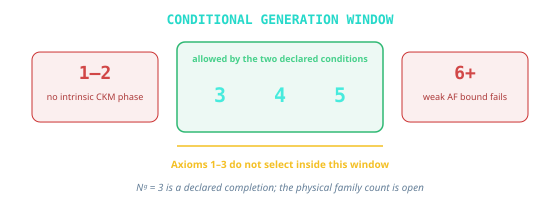

# Chapter 14: The Standard Model from Consistency

The electron's charge is exactly three times the down quark's, to every
decimal place anyone has measured. Nobody ordered that. The two particles
feel different forces and have nothing else obvious in common, yet their
charges lock together so precisely that a hydrogen atom is electrically
neutral to better than one part in a billion billion. Somewhere under the
particle catalog sits a locking mechanism. This chapter asks what that
mechanism is and how much of it can be reverse engineered from consistency
alone.

## 14.1 The Intuitive Picture: Particles and Forces Are Fundamental

The intuitive picture treats the universe as particles with forces acting
between them. The Standard Model is the final inventory of what
exists.

In this picture, an electron is a tiny object with definite properties, and
fields are invisible fluids that fill space. You learn the Standard Model as a
catalog: quarks, leptons, gauge bosons, the Higgs. That is the whole picture.

This view works for calculations. It also hides what is actually strange about
our best theory of matter.

## 14.2 The Surprising Hint: The Standard Model Is Not Fundamental

The Standard Model is extremely successful, and it carries deep warnings. Its
vacuum energy and loop integrals blow up in the ultraviolet, its couplings run
with scale, its anomaly cancellations are delicate, and its chirality is
startling. These clues point to an emergent effective description rather than
a foundation.

## 14.3 The Quantum Revolution

To understand what the Standard Model really says, we need to start with
quantum mechanics itself. Quantum mechanics is deeply, irreducibly weird.

### Planck's Desperate Act

In December 1900, Max Planck presented a formula to the German Physical
Society. He called it "an act of desperation."

The problem was blackbody radiation. When you heat an object, it glows. At low
temperatures, it glows red. Hotter, it glows white. The question was: how much
light at each wavelength?

Classical physics gave a disastrous answer. The Rayleigh-Jeans formula
predicted infinite energy at short wavelengths. Ovens should emit deadly gamma
rays. This was the "ultraviolet catastrophe."

Planck found a formula that fit the data extremely well. To derive it, he had
to assume something absurd: energy comes in discrete packets. Light of
frequency $f$ carries energy in multiples of $hf$, where $h$ is a tiny
constant.

$$E = nhf, \quad n = 0, 1, 2, 3, \ldots$$

Planck did not believe this was real physics. He thought it was a mathematical
trick. It took Einstein to show it was genuine.

### Einstein's Light Quanta

In 1905, Einstein explained the photoelectric effect. When light hits metal,
electrons pop out. The energy of those electrons depends only on the light's
frequency, not its intensity. Brighter light produces more electrons, not
faster ones.

Einstein argued that light really does come in packets. A photon of
frequency $f$ carries energy $hf$. One photon kicks out one electron. The
photon's frequency determines the electron's energy.

This was radical. For a century, physicists had piled up proof that light was a wave. Young's double-slit experiment showed interference patterns. Maxwell's equations described electromagnetic waves. Einstein was saying light was particles?

Both were true. Light is neither purely wave nor purely particle. It's something new that exhibits both behaviors depending on how you probe it.

### Bohr's Atom

In 1913, Niels Bohr proposed a model of the hydrogen atom. Electrons orbit the
nucleus, but only in specific orbits. When an electron jumps between orbits, it
emits or absorbs a photon.

The model was frankly bizarre. Why should only certain orbits be allowed? Bohr
had no answer. He declared that angular momentum must be quantized:

$$L = n\hbar, \quad n = 1, 2, 3, \ldots$$

The model worked brilliantly for hydrogen. It explained the Balmer series, the
specific wavelengths of light that hydrogen emits. It failed for everything
else. Helium was a mess. The model was obviously incomplete.

### de Broglie's Audacity

In 1924, Louis de Broglie made a wild proposal in his PhD thesis. If light
waves can behave like particles, maybe particles can behave like waves.

He proposed that every particle has an associated wavelength:

$$\lambda = \frac{h}{p}$$

where $p$ is momentum. For everyday objects, this wavelength is absurdly tiny.
A baseball's de Broglie wavelength is about $10^{-34}$ meters. For electrons,
it is comparable to atomic sizes.

In 1927, Davisson and Germer proved de Broglie right. They bounced electrons off a nickel crystal and saw interference patterns. Electrons really do behave like waves.

### Schrödinger's Equation

Erwin Schrödinger took de Broglie's idea and ran with it. If electrons are
waves, what is waving?

Schrödinger proposed that electrons are described by a wave function
$\psi(x,t)$. The equation governing this wave is:

$$i\hbar \frac{\partial \psi}{\partial t} = -\frac{\hbar^2}{2m}\nabla^2\psi + V\psi$$

This is the Schrödinger equation, and it works spectacularly well. It predicts
atomic spectra, chemical bonds, and semiconductor behavior. It is the
foundation of quantum chemistry and materials science.

What is $\psi$? Schrödinger initially thought it described a smeared-out
electron, spread across space like a cloud. Max Born had a different
interpretation: $\psi$ squared gives the probability of finding the electron at
each location.

$$P(x) = |\psi(x)|^2$$

Operationally, the wave function does not assign a classical trajectory. It gives the probabilities for different measurement outcomes.

The early formulas introduce the basic quantum dictionary. In Planck's
$E=nhf$, $E$ is energy, $n$ is a whole-number quantum count, $h$ is Planck's
constant, and $f$ is frequency. In Bohr's $L=n\hbar$, $L$ is angular momentum
and $\hbar=h/(2\pi)$. In de Broglie's $\lambda=h/p$, $\lambda$ is wavelength
and $p$ is momentum. In Schrödinger's equation, $\psi$ is the wave function,
$m$ is mass, $V$ is potential energy, and $\nabla^2$ measures spatial
curvature of the wave. Born's rule, $P(x)=|\psi(x)|^2$, turns the wave
function into a probability density for detection at position $x$.

That dictionary was assembled by many people under pressure from experiment.
Planck's blackbody curve, Einstein's photons, Bohr's spectral lines, de
Broglie's matter waves, Schrödinger's wave mechanics, Heisenberg's matrices,
Born's probability rule, Dirac's relativistic equation, and Feynman's diagrams
are different steps in one long reconstruction. The Standard Model inherits
that whole history.

### Heisenberg's Uncertainty

Werner Heisenberg approached quantum mechanics differently. He focused on observables: things you can actually measure.

In June 1925, suffering from hay fever on the island of Helgoland, Heisenberg developed matrix mechanics. Observable quantities became matrices. When he tried to calculate, he discovered something strange: the order of multiplication matters.

Position times momentum is not the same as momentum times position:

$$XP - PX = i\hbar$$

Here $X$ and $P$ are operators, the matrix versions of position and momentum,
and the $i$ is what keeps the two measurements from being simultaneously
sharp. This commutation relation is the mathematical heart of quantum mechanics. It implies the uncertainty principle:

$$\Delta x \cdot \Delta p \geq \frac{\hbar}{2}$$

You cannot simultaneously know both position and momentum with arbitrary precision. This is a fundamental feature of reality. There is no state that has both precise position and precise momentum.

### The Copenhagen Interpretation

Bohr and Heisenberg developed what became the "Copenhagen interpretation." In this reading, the wave function describes our knowledge rather than objective reality. When we measure, the wave function "collapses" to a definite value.

This interpretation was never universally accepted. Einstein famously objected: "God does not play dice." The mathematics works. Quantum mechanics makes predictions, and those predictions are confirmed to extraordinary precision.

The core lesson is operational. Quantum theory gives probabilities for measurement outcomes with extraordinary accuracy. What those probabilities mean ontologically depends on the interpretation.

## 14.4 From Particles to Fields

Quantum mechanics describes particles. But particles can be created and destroyed. An electron and positron can annihilate into photons. A photon can create an electron-positron pair. How do you write a wave function for a variable number of particles?

You don't. You need quantum field theory.

### Dirac's Equation

In 1928, Paul Dirac sought a relativistic version of Schrödinger's equation. He found something deeper.

The Dirac equation describes spin-1/2 particles like electrons:

$$i\hbar \gamma^\mu \partial_\mu \psi - mc\psi = 0$$

The equation had a problem: it predicted states with negative energy. An electron could fall into these states, releasing infinite energy.

The matrices $\gamma^\mu$ are Dirac gamma matrices. They package spin and
relativity into one algebraic object. The derivative $\partial_\mu$ measures
change in the spacetime direction $\mu$. The field $\psi$ is a spinor
field, not a single nonrelativistic wave, and $mc$ carries the particle
mass scale. Dirac's compact line says that spin, antimatter, and special
relativity belong together.

Dirac's solution was audacious. The negative energy states are filled. The vacuum is a sea of negative-energy electrons. What we call a "positron" is a hole in this sea.

This prediction was confirmed in 1932 when Carl Anderson photographed positron tracks in a cloud chamber. Antimatter exists.

### Second Quantization

The Dirac sea was a stepping stone. The modern view is cleaner: fields are the fundamental objects, and particles are excitations of fields.

Consider a violin string. The string can vibrate in different modes. Each mode has a definite frequency. When you pluck the string, you excite various modes.

Quantum fields work similarly. The electromagnetic field can be decomposed into modes. Each mode is a quantum harmonic oscillator. Exciting a mode means adding photons.

The vacuum, in this picture, is the ground state of all fields, with every mode in its lowest energy state. Even that lowest state has fluctuations, and these zero-point fluctuations are real and measurable.

### Feynman Diagrams

Richard Feynman developed a beautiful pictorial language for particle physics. Draw space horizontally and time vertically. Particles are lines. Interactions are vertices where lines meet.

An electron emitting a photon:

```
    e- ---•--- e-
          |
          γ
```

The power of Feynman diagrams is that each diagram corresponds to a mathematical expression. You can calculate by drawing pictures.

To find the probability of a process, you draw all possible diagrams and add them up. This is perturbation theory. It works when interactions are weak.

### Renormalization

Loop calculations produce infinities.

Consider an electron. It's surrounded by a cloud of virtual photons. These photons affect the electron's mass and charge. When you calculate this effect, you get infinity.

The solution is renormalization. You absorb the infinities into the definition of mass and charge. The "bare" parameters are infinite, but the physical parameters are finite.

This sounds like cheating, but it works with astonishing precision. Quantum electrodynamics (QED) predicts the electron's magnetic moment to 12 decimal places. The prediction agrees with experiment to extraordinary precision.

Renormalization works for some theories (called "renormalizable") but not others. The Standard Model is renormalizable. Perturbative Einstein gravity is not. This is one reason gravity lies outside the Standard Model.

### Running Couplings

A strange consequence of renormalization: coupling constants change with energy.

The fine-structure constant measures the strength of electromagnetism, and it
too drifts with energy. The OPH construction proposes maps whose unique roots
land near $137$. Electroweak running and the vacuum response of quarks and hadrons
define the proposed transport down to the value measured in the laboratory,
the Thomson coupling, the electromagnetic strength read off at
zero energy.

That low-energy number lives in the same electroweak theory as the W and Z
bosons. Once the electroweak structure is fixed, electromagnetism is the
unbroken piece left after the weak and hypercharge parts mix together. The OPH
code includes running-coordinate and finite-order pole prescription checks.
One note covers this whole construction. The bounded calculation harness
consumes an externally supplied Standard Model packet. Two independent raw
loop calculations, a separate production verifier, certified complex
contours, source matching, gauge identities, physical-current amplitudes, and
an observer clock are work in progress. The checked algebra is a demanding
test of the pole calculation, rather than an OPH prediction of a physical W
or Z mass.

The strong force coupling runs the opposite way. At low energies, it's strong (hence the name). At high energies, it weakens. This is "asymptotic freedom," discovered by Gross, Wilczek, and Politzer in 1973.

Running couplings mean the "constants" of physics aren't constant. They depend on the scale at which you probe.

## 14.5 The Standard Model Zoo

The Standard Model organizes all known particles into a coherent model.

### Fermions: The Matter Particles

Matter is made of fermions: particles with spin 1/2. They obey the Pauli exclusion principle. No two identical fermions can occupy the same quantum state. This gives atoms structure, gives us the periodic table, and keeps you from falling through the floor.

**Quarks** come in six flavors. Up, charm, and top carry charge $+2/3$. Down,
strange, and bottom carry charge $-1/3$. The name is a joke that stuck: Murray
Gell-Mann, proposing fractionally charged constituents in 1964, lifted it from
a line in *Finnegans Wake*, "Three quarks for Muster Mark." George Zweig,
working out the same idea independently at CERN, called them aces; his paper
never got past the referees into a journal, and Gell-Mann's word won.

Quarks are never found alone. They're always bound into hadrons by the strong force. Protons are (uud), neutrons are (udd).

**Leptons** also come in six types. The electron, muon, and tau carry charge
$-1$. Their three neutrinos are neutral.

The electron is stable. The muon and tau decay quickly.

### Three Generations

The fermions come in a strange pattern: three copies. The up and down quarks, plus the electron and its neutrino, form the first generation. The charm and strange quarks, plus the muon and its neutrino, form the second. The top and bottom, plus the tau and its neutrino, form the third.

The Standard Model by itself does not explain why there are three generations.
In OPH, on the declared one-Higgs class, the CP and weak-sector conditions
leave three, four, or five generations. A separate screen theorem selects a
rank-three response candidate under two named premises. Its identification
with three physical families is open; section 14.12 states its standing
precisely. The charged members of the second and
third observed generations are heavier copies of the first, while the
neutrino sector has its own mixing pattern. Almost all ordinary matter uses
only first-generation particles.

### Bosons: The Force Carriers

Forces are mediated by bosons: particles with integer spin.

**Photon** (spin 1): The observed quantum of the electromagnetic field. In the
ordinary Maxwell vacuum it has a massless pole, travels at the invariant null
speed, and couples to electric charge.

**W and Z bosons** (spin 1): Carry the weak force. W has charge plus or minus 1. Z is neutral. Both are massive: about 80-90 GeV. The weak force is weak at low energies because its carriers are heavy.

**Gluons** (spin 1): Carry the strong interaction in perturbative descriptions.
There are eight color components. The pure Yang-Mills quadratic action has no
hard mass term, but confined QCD has no isolated free-gluon particle pole.

The Yang-Mills mass gap is a statement about the spectrum of the strong
interaction, separate from assigning a hard mass to the gluon. OPH has a
conditional route in which a compact gauge action and a uniform positive
repair gap would supply that spectrum. A finite signed seam operator on one
source capture has an exact positive finite-domain gap. That finite graph
operator supplies neither the continuum gauge theory and its vacuum nor the
uniform limiting bound required by the Yang-Mills problem.

**Higgs boson** (spin 0): The source of mass for W, Z, and fermions. Discovered at CERN in 2012. Mass about 125 GeV.

**Graviton** (spin 2): The hypothetical carrier of gravity. Not part of the Standard Model. Never directly detected.

### The Gauge Groups

The Standard Model is organized by symmetry. One usually writes the gauge group as:

$$G_{SM} = SU(3)_C \times SU(2)_L \times U(1)_Y$$

The notation names three continuous accounting systems. $SU(3)$ is a
three-component special-unitary symmetry, $SU(2)$ is its two-component cousin,
and $U(1)$ is the circle-like symmetry behind a single conserved charge. The
subscripts say which physical bookkeeping each factor carries.

$G_{SM}$ means "the Standard Model gauge group." The subscript $C$ means color.
The subscript $L$ means left-handed weak isospin. The subscript $Y$ means
hypercharge, the charge that mixes with weak isospin to produce ordinary
electric charge after symmetry breaking. The product sign means the three
symmetry systems are present together.

**SU(3)_C** is the color group. Quarks carry color charge: red, green, or blue. Gluons carry color-anticolor combinations. The strong force binds quarks into colorless combinations.

**SU(2)_L** is the weak isospin group. It acts only on left-handed particles.
The weak force therefore violates parity.

**U(1)_Y** is the hypercharge group. It combines with SU(2)_L to give electromagnetism after symmetry breaking.

The subscripts matter. L means "left-handed." The weak force distinguishes left from right. This is one of nature's deepest asymmetries.

## 14.6 Chirality: Nature's Handedness

Nature treats left and right differently. This is one of the deepest
asymmetries in the Standard Model.

### What Is Chirality?

A relativistic fermion has a left-handed face and a right-handed face. For
massless particles, that split lines up with helicity, with spin either
tracking the motion or leaning against it. For massive particles the relation
is subtler, but the left-right split remains built into the theory.

Helicity is the easy visual version: compare the direction of a particle's spin
with its direction of travel. Chirality is the deeper field-theory label. For
massless particles they coincide; for massive particles they do not have to.

### The Weak Force Discriminates

The charged weak interaction carried by the $W$ boson couples only to
left-handed fermions. A right-handed electron sits out those charged-current
processes.

This was discovered through parity violation experiments in 1956-1957. Chien-Shiung Wu gave up a long-planned steamship passage to Asia, her first return since leaving China, and spent the end of 1956 at the National Bureau of Standards in Washington, watching cobalt-60 decay at a fraction of a degree above absolute zero. If parity were conserved, electrons should emerge equally in both directions along the spin axis. They didn't. More electrons came out opposite to the spin.

Lee and Yang had predicted this. Wu proved it. Parity violation earned Lee and Yang the Nobel Prize. Wu, who did the experiment, was not included.

### Why Chirality Matters

Chirality matters everywhere. It is essential to weak parity violation and to
anomaly-cancellation constraints, and it sharply restricts which fermion mass
terms can appear without extra structure.

## 14.7 Anomaly Cancellation: Why the Charges Are What They Are

Consider the electric charges of quarks and leptons. At first glance they look
arbitrary: the up quark at $+2/3$, the down quark at $-1/3$, the electron at
$-1$, the neutrino at $0$. The real explanation is anomaly cancellation.

### What Is an Anomaly?

A quantum theory can look symmetrical in its classical dress and tear at
the seams once quantization is done. That failure is an anomaly. If it hits a
gauge symmetry, the theory stops being self-consistent.

### The Cancellation

The Standard Model survives because one generation of quarks and leptons
cancels every dangerous hypercharge contribution at once. Color, weak charge,
the cubic hypercharge sum, and the gravitational sum all close together.

The famous charges do not float freely. Thirds of an electron charge are
exactly the values that let the structure hold.

### Connection to OPH

The same issue appears in geometric dress. Glue observer patches around
a loop and return to the starting point. If some leftover phase remains, the
gluing tears. Field theory calls that failure an anomaly. The screen picture
calls it bad loop bookkeeping. Either way the cure is the same: the charge
assignments must make the loop close cleanly.

The Standard Model's hypercharges look so crisp for that reason. Up to overall
normalization, they are the solution that lets the gluing hold together.

## 14.8 The Higgs Mechanism

The Standard Model has a puzzle. A pure gauge kinetic action has massless
quadratic modes, yet the W and Z are massive. Gauge redundancy can coexist
with their mass because the Higgs field changes the physical phase.

### Spontaneous Symmetry Breaking

Consider the Higgs potential:

$$V(\phi) = -\mu^2|\phi|^2 + \lambda|\phi|^4$$

This is symmetric under rotations in field space, but the minimum sits away from zero, in a circular valley at radius $v=\mu/\sqrt{\lambda}$.

$\phi$ is the Higgs field. $\mu$ and $\lambda$ are parameters of the
potential. The negative quadratic term pushes the field away from zero, while
the positive quartic term keeps the energy from running off to infinity. The
nonzero radius of the valley is the vacuum expectation value that feeds masses
to the weak bosons and fermions.

The field "falls" to some point in this valley. The symmetry is broken spontaneously. The equations are symmetric; the ground state is not.

That settled nonzero value is called the vacuum expectation value: the
background value of the Higgs field that other particles move through.

### Eating Goldstone Bosons

When a continuous symmetry is spontaneously broken, massless particles appear: Goldstone bosons. They correspond to motion along the valley.

In a gauge theory, something special happens. The gauge bosons "eat" the Goldstone bosons and become massive. This is the Higgs mechanism.

For the electroweak group SU(2) x U(1), three Goldstone bosons get eaten. The
W+, W-, and Z become massive. One combination of generators remains unbroken.
On the ordinary vacuum with the Maxwell kinetic term, that electromagnetic
combination has the familiar massless transverse pole.

### Fermion Masses

Fermions also get mass from the Higgs. The Yukawa couplings connect left-handed and right-handed fermions through the Higgs field:

$$\mathcal{L}_{Yukawa} = y_e \bar{L} \phi e_R + y_u \bar{Q} \tilde{\phi} u_R + y_d \bar{Q} \phi d_R + \text{h.c.}$$

This line is a compact part of the Lagrangian, the formula that says which
field interactions are allowed. The $y$ values are Yukawa couplings. They set
how strongly each fermion talks to the Higgs field, and therefore how much mass
that fermion gets after symmetry breaking.

The barred fields are conjugate fields. $L$ is a left-handed lepton doublet,
$Q$ is a left-handed quark doublet, and $e_R$, $u_R$, and $d_R$ are
right-handed charged-lepton, up-type-quark, and down-type-quark singlets.
$\tilde{\phi}$ is the Higgs doublet arranged with the conjugate weak charge.
"h.c." means Hermitian conjugate, the companion term required to make the
Lagrangian real.

When the Higgs gets a vacuum expectation value, these terms become mass terms. The masses are proportional to the Yukawa couplings.

Why do the Yukawa couplings have the values they do? Why is the top quark so much heavier than the electron? The Standard Model leaves this unexplained.

## 14.9 From Overlaps to Gauge Structure

Before the machinery starts, it helps to know what comes out. Given the
declared twelve-port carrier and its current and matter premises, the
construction recognizes the Standard Model gauge symmetry type, its sixfold
global quotient, and the fifteen chiral states of one generation. The
icosahedral faces also supply a natural three-place candidate for the family
slot under two additional premises. Combining those ranks gives a conditional
forty-five-direction candidate. Its chirality and sixfold central action come
from the generation table. A separate finite domain checks what happens if a
signed local operator is repeated across those forty-five directions: its
positive dimensionless gap survives. The source does not choose that matter
action, and the finite spin packet has not been transported to the operator
domain.

This is architectural recognition. Think of working out a machine's
instruction set from its wiring before anyone has connected it to a motor.
Turning that finite candidate into three physical particle families requires a
matter-pole map, a continuum account of spin and locality, and a
laboratory current. Scalar multiplicity and interacting fields require
additional constructions as well.

The finite W and Z pole algebra has a separate machine-checked theorem once a
complete renormalized electroweak theory is supplied. A physical resonance
also needs measurable-current coupling, scale matching, uncertainties, and a
clock. The carrier admits more than one current and matter completion, so its
richer self-readback has real work left to do.

Two routes carry the chapter. One reconstructs a compact symmetry from the way
charges cross patch boundaries. The other reads a specific current algebra
from the twelve-port carrier. Their agreement is interesting precisely because
they begin from different information.

### Gauge as Gluing Redundancy

In the standard presentation, gauge symmetry is a postulate. You write down a Lagrangian that's invariant under local transformations.

A local transformation is a change of internal description that can vary from
point to point. Gauge symmetry says such changes must not alter physical
predictions.

On the compact-current branch, gauge symmetry is reconstructed from the
redundancy in how observers glue and transport charge across their patches.

Different observers describe the same overlap region using different frames. The transformation between frames is a gauge transformation. The freedom that leaves overlap observables invariant forms the gauge group.

This is gauge-as-gluing. Gauge symmetry becomes the grammar of how charged
patch descriptions fit together.

One finite source run makes part of this picture tangible. Its observer-visible
seam complex contains thirty-eight frustrated triangles, so the signs cannot
all be removed by changing local conventions. Scalar, chiral, and gauge
sections live on the same finite object, and their local signed operators obey
the tested adjoint, kinetic, covariance, boundary, and refinement relations on
declared deterministic sections. Two coordinate routes through the same
finite-field rank calculation agree on the lift-ambiguity count and verify its
rank identity. This is one implementation with an algebraic cross-check.
The signed-graph theorem fixes the kernel. This
constructs finite twisted sectors and their operators. Physical spin,
continuum quantum fields, particles, and detector couplings require separate
attachments.

The gluing rules support a conditional route to the Yang-Mills action. Once the
edge transports form a physically constructed compact current system and the
four-dimensional scaling limit exists, the long-distance field theory takes
the usual curvature-squared form. The mass-gap theorem needs a uniform positive
repair floor on that actual gauge construction. A slogan about gluing cannot
supply either object.

### Edge-Center Completion

When you have a boundary between patches, there are degrees of freedom that live on the edge. These edge modes carry "charges" that label how the two sides connect.

Technically, the Hilbert space decomposes:

$$\mathcal{H}_{collar} = \bigoplus_\alpha (\mathcal{H}_{left}^\alpha \otimes \mathcal{H}_{right}^\alpha)$$

The letter $\mathcal H$ names a Hilbert space, the quantum state space for a
piece of the system, and the collar is the thin overlap zone near a boundary.
The direct-sum symbol splits the boundary data into sectors labeled by
$\alpha$, and the tensor product joins the left and right sides of one shared
edge-charge sector. The formula is the precise way to say that an edge
carries a label both neighboring patches must respect.

The labels alpha are the edge charges visible in this one-collar algebra. In
the bosonic gauge picture they are the seed carriers for the tensor category
from which the boundary gauge group is reconstructed. They are not assumed to
list every charge generated when seeds are fused. A fixed collar can therefore
have finitely many visible blocks while the tensor-generated category has
infinitely many simple charge types.

The construction keeps only the charges whose loops close cleanly under one
shared transport choice. Charges that would need a different, incompatible choice
belong to separate families and are not quietly merged in.

### Fusion Rules Define the Group

When you concatenate collars, edge charges fuse. The fusion rules:

$$\alpha \otimes \beta = \bigoplus_\gamma N_{\alpha\beta}^\gamma \, \gamma$$

define a tensor category. The Tannaka-Krein reconstruction theorem says, roughly,
that once the charges combine consistently, survive being carried between
patches, and hold together as the description is refined, you can read the
compact symmetry group directly off the way they fuse and represent one another.
The group is recovered from the full pattern of how charges behave, with the
fusion table at its center.

For intuition, treat the fusion rules as a multiplication table for charges.
If you know how every charge combines with every other charge, you have enough
information to recover the symmetry that those charges are representing.

The labels $\alpha$, $\beta$, and $\gamma$ are charge sectors. The tensor
symbol $\otimes$ means "combine these sectors." The integers
$N_{\alpha\beta}^{\gamma}$ count how many times sector $\gamma$ appears when
$\alpha$ and $\beta$ fuse. A tensor category is the organized collection of
these sectors, their fusions, their duals, and their consistency rules.
It is a bookkeeping machine for charges: which charges exist, how they combine,
which charge is the mirror of which, and which combinations count as the same
operation in different orders.

The gauge group is reconstructed from that fusion data rather than guessed in
advance.

{width=82%}

Recovering the group in the fine-grained limit uses one extra consistency
condition. Each time you look at the boundary more closely, the coarse picture
and the finer picture line up cleanly, so that no charge splits apart or appears
from nowhere as the resolution improves. The finer-and-finer descriptions then
converge on one compact gauge group.

For intuition, picture a boundary that carries one unit of charge. Stacking such
boundaries builds two units, then every whole-number charge, which is exactly
the ladder a $U(1)$ symmetry produces.

### The Standard Model Factors

Why does the realized group have the form SU(3) x SU(2) x U(1) up to finite quotient?

A quotient means that some formally different group elements act the same on
all physical states and are counted once. It is like discovering that two labels
on a wiring diagram name the same actual connection. The Standard Model quotient
removes that duplicate counting across color, weak isospin, and hypercharge.

From the transportable charge sectors, reconstruction gives a compact gauge
group. This is one independent route. The twelve-port carrier gives a second:
incidence and target-blind port readback derive the signed response
$R=-J$. An exact compact lift then realizes the Standard Model
current algebra. Given the declared conjugate pair of exterior matter modules,
the matter and central-descent receipts fix the charge lattice up to
conjugation, the three-color carrier, and the common center kernel. Classification
keeps gluing patterns that fit around every loop. No selection principle is
used in this conditional finite implication.

The consistency test underneath that first stage is technical, and its point is
simple. Some ways of gluing patches around a loop leave a leftover twist, and
the theory keeps only the gluing choices where a compatible twist-free option
exists. Everything downstream builds on the choices that survive.

Under those finite contracts, the compact current has one abelian direction,
a weak triplet of generators, and eight color generators. The matter receipt
derives determinant balance and a primitive charge pair related by charge
conjugation. It also tells us which apparently different transformations act
identically on every declared tensor. There are six of them. Counting those
duplicates once gives the maximal faithful matter image

$$
S(U(3)\times U(2))\cong
\frac{SU(3)\times SU(2)\times U(1)}{\mathbb Z_6}.
$$

The representation words only say how a particle multiplet transforms. A weak
doublet is a two-entry object rotated by the weak symmetry. A color triplet is a
three-entry object rotated by the color symmetry. "Pseudoreal" and "complex"
distinguish whether the mirror representation is effectively the same object or
a genuinely different one.

Within the declared determinant-balanced $3+2$ exterior packet, the quark
doublet is a color triplet and $N_c=3$. On the same one-Higgs class, intrinsic CKM
CP capability requires at least three generations and weak-sector ultraviolet
consistency permits at most five. Those conditions leave three, four, or
five generations. The graph and anomaly equations do not choose among them.
A separate screen-band calculation does choose rank three under two additional
premises, as described below. Combining that band with three copies of the
fifteen-state pattern gives a conditional forty-five-direction candidate.
Connecting the candidate to three physical matter families is open. The
Witten anomaly is a consistency check on the triplet-doublet arithmetic.

The distinction is sharp: no physical family clause enters this conditional
current, charge, or $\mathbb Z_6$ kernel calculation. Identifying the
rank-three candidate with physical families and excluding extra light sectors
require independent constructions.

### The Icosahedral Closure Route

Count the sockets before naming a force. Twelve vertices, six opposite pairs,
thirty edges, and twenty oriented faces leave a particular algebraic
fingerprint. A cubic carrier would leave another one. The hardware geometry
therefore enters the particle argument at its first finite line, long before a
quark or a weak boson appears.

The finite carrier recognizes the same Lie type from a second direction
through a source-derived response. This route starts with the reference
microarchitecture from Chapter 3, long before quarks, weak doublets, or
measured particle data enter the story. On the declared twelve-port carrier,
the defect readback lives at twelve equivalent ports. The separate integer
total-twelve load and quadratic readback packet has a unique all-unit
minimizer, with every alternative costing at least two units more. This is an
exact result in the declared counting realization. A reduced finite-atomic
carrier model has a half-count candidate. Whether that candidate
extends to the full observer machinery, agreement maps, and maximum-randomness
state selection is open.

The local information curvature lies on the symmetric identity ray. For a
uniform twelve-port reference, relative entropy
begins as $6\varepsilon^2\sum_p v_p^2$. Its Hessian, equivalently the Fisher
matrix, is $12I$. That infinitesimal statement does not determine the complete
discrete repair cost. An operational source for the integer normalization and
physical cost is work in progress.

The wiring of the edges then does the rest. It pairs
each port with the one directly opposite it, three steps away across the
graph, it hands the whole structure the sixty rotations of a regular
icosahedron, the group called $A_5$, and it recovers the icosahedron's actual
three-dimensional shape from pure bookkeeping. None of these outputs change
when the description is refined or the ports are consistently relabeled.

The twelve real port readings form the permutation space

$$
P_{12}=\mathbf 1\oplus\mathbf 3\oplus\mathbf 3'\oplus\mathbf 5.
$$

This is more than the numerical identity $12=1+3+3+5$. The four pieces are
inequivalent representations, so an $A_5$-symmetric operation can recognize
each block without mixing copies of the same kind. Pairing opposite ports
turns the local coefficient space into six axes. The even readings split into one uniform mode
and five centered modes. They map exactly to the scalar and traceless-symmetric
parts of a three-by-three matrix. The odd readings split into two different
three-dimensional spaces. The outward orientation of the twenty faces supplies
the handedness needed to orient the second one.

Those pieces fit the Standard Model adjoint in one precise way:

$$
\underbrace{\mathbf1}_{\mathfrak u(1)}
\oplus
\underbrace{\mathbf3}_{\mathfrak{su}(2)}
\oplus
\underbrace{(\mathbf3'\oplus\mathbf5)}_{\mathfrak{su}(3)}.
$$

The last bracket has dimension eight, the number of color gauge directions.
The other triplet has dimension three, the number of weak gauge directions.
The singlet supplies the abelian direction. The $A_5$ triplet in this formula
is not the three-color matter representation. It is one part of the
eight-dimensional color **adjoint**, the space of color gauge generators. The
fundamental color triplet is selected separately with the matter package.

The geometry also gives an explicit multiplication law. The even and odd port
modes map to $\mathfrak u(3)\oplus\mathfrak{so}(3)$. Pulling the ordinary
matrix commutator back to the ports produces

$$
\mathfrak u(3)\oplus\mathfrak{so}(3)
=
\mathfrak u(1)\oplus\mathfrak{su}(3)\oplus\mathfrak{su}(2).
$$

Antisymmetry and the Jacobi identity, the standard consistency rule that any
bracket of symmetry generators has to satisfy, then come for free from the
matrix commutator. The five-dimensional block is genuinely noncommuting,
which is what lets it join the color algebra rather than sit in an abelian
center. The bracket acts on fluctuations of the coefficients and currents;
the records that observers actually read stay in the commuting part.

The distinction between symmetry and multiplication matters. $A_5$ symmetry
by itself permits fourteen equivariant antisymmetric products on the twelve
coefficients. It does not select this Lie bracket. Requiring a compact
connected current algebra narrows the possibilities to three:

$$
\mathfrak u(1)^{12},\qquad
\mathfrak{su}(2)^2\oplus\mathfrak u(1)^6,\qquad
\mathfrak{su}(3)\oplus\mathfrak{su}(2)\oplus\mathfrak u(1).
$$

If the five-dimensional block acts noncentrally, the first two disappear. The
same conclusion follows when the $A_5$ action on a twelve-dimensional compact
current algebra is implemented by internal gauge transformations.

Here is the exact response theorem and its boundary. Incidence determines the
unique nonidentity central graph involution $J$. Its action is positive on the
$\mathbf1$ and $\mathbf5$ sectors and negative on the two triplets. A
target-blind impulse/readback protocol derives
$10J=A^3-4A^2-5A+10I$ and implements $R=-J$; the common sign is charge
conjugation. From that response, the simulator and
the independent exact certificate constructs
$\mathfrak u(3)\oplus\mathfrak{so}(3)$ with closure, covariance, inner action,
and a positive invariant pairing. The finite port symmetry alone does not
select a general linear response: its equivariant commutant is
four-dimensional. Identification with measured laboratory gauge currents is
open.

The six axes carry two further pieces of structure. Their integral load
lattice has an exact sixfold residue. On the conjugate pair of
fifteen-state exterior modules, the unique nonempty chiral anomaly-free
selection in the exhaustive scan of all 1024 module subsets, anomaly freedom
forces determinant balance,
while primitive integrality fixes the color and weak block charges up to
simultaneous conjugation. Exhaustive enumeration of the central action on
every declared tensor gives a common $\mathbb Z_6$ kernel, so quotienting by
the full kernel produces the maximal faithful matter image.

The same local tensors also descend through the cover and its intermediate
$\mathbb Z_2$ and $\mathbb Z_3$ quotients, so the local tensor table by itself
does not select among the four compatible global forms. The source-bound
deck/loop receipt measures an order-six axis class and the complete six-sector
flux menu. Its exact intertwiner with the tensor kernel and the selected line
polarization pick the $\mathbb Z_6$ quotient at finite source-model scope.
Laboratory flux measurements, continuum quantum field theory,
four-dimensional instanton normalization, monopole dynamics, and theta
periodicity are separate.

The face structure organizes families. The twenty outward faces form one
orbit, and the threefold symmetry of each face cycles its corners. The only
one-dimensional representation of $A_5$ is the trivial one, and $A_5$ has no
two-dimensional irreducible representation at all, so the smallest global
carrier of a nontrivial face phase has dimension exactly three. The screen,
in other words, comes with a natural three-place slot built into its faces, a
canonical candidate home for the three families.

The full coefficient space makes this sharper. It splits into bands of sizes
one, three, three, and five. If the family carrier is one complete faithful
band in the allowed three-to-five window, and if the screen's mismatch cost is
the comparison rule, the three candidates cost

$$5-\sqrt5,\qquad 6,\qquad 5+\sqrt5.$$

The first cost is uniquely smallest, so rank three wins. Lean checks the band
split and the exact inequalities. The simulator sends an impulse through the
declared unitary screen channel and reconstructs the same rank-three residue at
its lowest positive frequency. Since the channel is unitary, its mode sizes do
not decay; this is a frequency result, not a relaxation result.

This result selects a finite screen object. Combining it with the
fifteen-state generation table gives a conditional object with forty-five
complex directions. The table is chiral, its anomalies cancel, and its
sixfold central action is exact. A separate finite domain checks a declared
signed operator repeated across all forty-five directions. Its positive
dimensionless gap is inherited from that domain. The source does not choose
this matter action, and there is no certified transport from the finite spin
packet to the operator domain. A physical family claim needs a matter-pole map, continuum
spin and locality, the physical seam choice, persistence under a further
comparison, and a laboratory identification. It must also show that no extra
light sectors have slipped in through a side door.

Put together, the carrier and target-blind readback supply an exact
gauge-adjoint symmetry type. The fermionic typing is measured at finite source
scope through the center of the transport double cover and its section
obstruction. The matter and descent receipts then supply a conjugate pair of
hypercharge assignments, chirality, the color fundamental, the weak doublet,
the compatible scalar-charge pair, three invariant interaction channels, and
the conjugation-insensitive sixfold kernel and maximal faithful image. The
calculation leaves the continuum global form, scalar multiplicity, and
physical matter attachment open.

This is the architectural part of the particle story. The carrier fixes which
finite transformations and charge packages fit together without contradiction.
The response contract turns that finite geometry into current directions. The
matter contract identifies a chiral package that survives the anomaly checks.
A particle seen in a detector requires the separate route from those finite
objects to a laboratory current, a physical matter sector, and dynamical poles.
The book keeps those jobs separate because each one can fail independently.

### The Exterior Matter Package

Under the matter-projector contract, an exterior-algebra construction
generates a charge-conjugate pair of full matter-generation patterns. Anomaly
freedom forces trace balance, and primitive integrality fixes the
five-component carrier up to simultaneous charge conjugation. Choosing the
displayed convention gives

$$
V=C\oplus W,
\qquad
C=(\mathbf3,\mathbf1)_{-1/3},
\qquad
W=(\mathbf1,\mathbf2)_{1/2}.
$$

Read a symbol like $(\mathbf3,\mathbf1)$ with a subscript as three answers in
one: how the object looks to the color force, how it looks to the weak force,
and its hypercharge tag. So $C$ is the three-place color carrier, $W$ is the
two-place weak carrier, and their weighted hypercharges add to zero:
$3(-1/3)+2(1/2)=0$. Form the non-vacuum even exterior package

$$
\Lambda^2V\oplus\Lambda^4V.
$$

$\Lambda^2$ means: choose two of the five slots, order irrelevant, no
repeats; $\Lambda^4$ means choose four. The pieces of this package are
exactly the fifteen left-handed Weyl states of one Standard Model generation,
a Weyl state being the smallest chiral building block a relativistic fermion
can be made from:

$$
\begin{aligned}
Q&=(\mathbf3,\mathbf2)_{1/6},&
u^c&=(\overline{\mathbf3},\mathbf1)_{-2/3},&
d^c&=(\overline{\mathbf3},\mathbf1)_{1/3},\\
L&=(\mathbf1,\mathbf2)_{-1/2},&
e^c&=(\mathbf1,\mathbf1)_1.
\end{aligned}
$$

Here an overbar marks the anticolor version of a charge, and a superscript
$c$ marks a field written in its antiparticle form.

The exterior powers do several jobs at once. They make the package chiral.
For a scalar with the compatible displayed charge, they produce the three
interaction channels $QHu^c$,
$QH^\dagger d^c$, and $LH^\dagger e^c$, each with one invariant line. Their
color, weak, gravitational, and cubic hypercharge anomalies all cancel.
The scan fixes the compatible scalar-charge pair and channel list, not the
number of physical scalar multiplets or their dynamics.

They also explain the weak load. The quark doublet appears in three color
copies, and the lepton doublet adds one more, giving four weak doublets per
generation. Four is even, so the global $SU(2)$ Witten check closes. The
declared three-family completion would therefore carry twelve
weak doublets after physical attachment, and pairing each slot with an
orientation label gives twenty-four oriented weak slots, the same finite
count as twelve ports with two orientations.

The recognition theorem applies to the source-derived carrier response and the
declared matter contract. It does not show that every OPH carrier must be
echosahedral, and it
imports no measured particle data. Recognizing the same abstract symmetry type
from the ports is also weaker than identifying the physical group, and the
port action by itself does not even single out a literal $8{+}3{+}1$ split of
the ports. Laboratory-current attachment, physical selection of the matter
projector, and the commuting action square identifying this route with the
independent Tannaka group are work in progress.

The family story carries its own fine print. The finite construction ties the
three-place band to three copies of the fifteen-state pattern. Promoting that
carrier to three physical generations requires proof that no extra family
band survives and that the identification holds under continuum refinement; a
physical CKM phase
further needs family breaking and a genuine interacting vertex structure. The
four-dimensional representation of $A_5$ cannot sneak in as a hidden Higgs,
because it has no complex structure compatible with the hypercharge action.
The twenty-four-slot equality above is a register identity, a matching of
counts that supplies no update rule and no physical current map. Masses,
mixing angles, coupling strengths, and poles belong to the dynamics carried
by these symmetry sectors, downstream of everything in this section.

## 14.10 Hypercharge from Gluing Consistency

Given the gauge group, what determines the matter content?

### The Anomaly Condition Again

Loop-coherent gluing requires a trivial central obstruction class and at least
one allowed strict edge transport with trivial represented holonomy around every
closed overlap loop. In the chiral matter theory, the same consistency burden
is anomaly cancellation: every local gauge variation must disappear from the
public physics.

Given one generation of chiral fermions with
$SU(3)\times SU(2)\times U(1)$ charges, and requiring Yukawa couplings to a
Higgs doublet, the hypercharge ratios are determined. A standard normalization
then fixes the absolute lattice.

### The Derivation

Start with Yukawa invariance. The Higgs coupling has to be neutral under
hypercharge, so the charges of the left-handed doublets, right-handed
singlets, and Higgs must add up in the allowed way:

$$Y_u = Y_Q + Y_H, \quad Y_d = Y_Q - Y_H, \quad Y_e = Y_L - Y_H$$

Add the anomaly cancellation conditions. The first line says that the weak
doublets cannot leave a mixed weak-hypercharge anomaly:

$$N_c Y_Q + Y_L = 0 \quad (SU(2)^2 U(1))$$

The second line is the mixed gravitational condition. It says the chiral
hypercharge assignment must remain consistent when the fermions couple to
gravity:

$$2N_c Y_Q - N_c Y_u - N_c Y_d + 2Y_L - Y_e = 0 \quad (\text{gravitational})$$

Solving those constraints first fixes the lepton and Higgs charges in terms of
the quark-doublet charge:

$$Y_L = -N_c Y_Q, \quad Y_H = N_c Y_Q$$

The right-handed singlet charges then follow from the Yukawa relations:

$$Y_u = (N_c+1)Y_Q, \quad Y_d = -(N_c-1)Y_Q, \quad Y_e = -2N_c Y_Q$$

With $N_c=3$ and standard normalization, the familiar lattice appears:

$$\boxed{Y_Q = \frac{1}{6}, \quad Y_L = -\frac{1}{2}, \quad Y_u = \frac{2}{3}, \quad Y_d = -\frac{1}{3}, \quad Y_e = -1, \quad Y_H = \frac{1}{2}}$$

These are exact rationals, the Standard Model hypercharges, with the ratios
fixed by anomaly freedom together with Yukawa invariance and the absolute
values fixed by standard normalization. There is nothing to tune. The
sixth-integer lattice is exactly the one compatible with the physical quotient
$(SU(3)\times SU(2)\times U(1))/\mathbb Z_6$.

The $Y$ symbols are hypercharges. $Q$ labels the left-handed quark doublet,
$L$ the left-handed lepton doublet, $H$ the Higgs doublet, and $u$, $d$, and
$e$ the up-type quark, down-type quark, and charged lepton singlet sectors.
$N_c$ is the number of colors. The boxed line is the familiar charge lattice
written before electroweak mixing turns hypercharge and weak isospin into
ordinary electric charge.

The equations explain why the charges come out in the strange pattern we observe.
Quarks carry third-integer charges because the weak interaction, the Higgs
couplings, and anomaly cancellation all have to coexist in one self-consistent
chiral theory.

## 14.11 The Number of Colors: Why N_c = 3

In the full argument, the color count is fixed directly by the same coupled
carrier that emits the $SU(3)$ factor. The global $SU(2)$ anomaly is an
important check on the realized structure, while the coupled carrier determines
the count.

### The Coupled Color Carrier

The weak sector needs a pseudoreal doublet. The color sector needs a genuinely
complex nonabelian role. The smallest common carrier that supports both on one
block is

$$\mathbb C^3 \otimes \mathbb C^2.$$

That fixes the quark doublet to be a color triplet:

$$\boxed{N_c = 3}$$

The declared determinant-balanced $3+2$ carrier produces the $SU(3)$ factor
and emits the color count inside the certified exterior-module menu. A
completeness theorem for that menu is open.

### The Witten Check

The global $SU(2)$ anomaly must cancel on the realized branch. Each
generation contributes $N_c$ quark doublets and one lepton doublet, so the
number of left-handed $SU(2)$ doublets per generation is

$$N_c + 1.$$

With $N_c=3$, this becomes

$$N_c + 1 = 4,$$

which is even. So Witten's anomaly is satisfied generation by generation. In
this derivation it confirms the realized triplet-doublet structure. It does not
select the color count.

## 14.12 Why Three Generations?

Anomaly cancellation works generation by generation. Each generation independently satisfies the conditions. So why three?

### CKM CP Capability Requires Three

The CKM matrix describes how quarks mix under the weak force. In general, it is
a unitary $N_g\times N_g$ matrix. CP means charge-parity reversal: swap
particles with antiparticles and mirror space. A CP-violating phase is a
built-in complex phase that lets those mirrored processes differ, one source
of particle-antiparticle rate differences in weak interactions. The number of
physical CP-violating phases is:

$$\text{(CP phases)} = \frac{(N_g - 1)(N_g - 2)}{2}$$

For $N_g=1$ or $N_g=2$, the formula gives zero phases. For $N_g=3$, it gives
one phase. The third generation is the first case with intrinsic CKM CP
capability.

So the declared CP-capable quark class requires at least three generations:

$$N_g \ge 3$$

### Weak-Sector UV Completability Limits

Too many generations spoil asymptotic freedom. Asymptotic freedom means an
interaction gets weaker at shorter distances or higher energies, and the beta
function is the bookkeeping rule for how a coupling changes with scale. The
$SU(2)$ beta function coefficient is:

$$b_{SU(2)} = \frac{22}{3} - \frac{1}{3}N_g(N_c + 1) - \frac{1}{6}$$

The final $-1/6$ is the contribution of one Higgs doublet. For
$b_{SU(2)} > 0$ (asymptotic freedom):

$$N_g(N_c + 1) < \frac{43}{2}.$$

With $N_c=3$, this becomes

$$4 N_g < \frac{43}{2} \implies N_g \le 5$$

Combining the lower and upper bounds gives the viable window:

$$3 \le N_g \le 5.$$

### The Window, the Screen Band, and the Physical Bridge

CKM CP capability and weak-sector UV completability define the viable window.
Here UV completability means that the theory can keep making sense at shorter
distances and higher energies, with no immediate breakdown when the resolution
is increased.

Those conditions leave three, four, or five generations. The three axioms and
the target-free matter reduct do not narrow the window. The separate
screen-band theorem does: under its single-band and cost premises, rank three
is the unique finite candidate. Combining it with the fifteen-state
generation pattern gives a conditional forty-five-direction candidate. The
physical family count is open because the map from that candidate to matter
poles has not been established. The finite theorem says:

$$\boxed{r_{\text{candidate}} = 3}$$

This is the conditional rank-three screen candidate. Anomaly
cancellation and the target-free source reduct do not force it. The finite
screen interface selects it under named premises. A separate local-domain
receipt checks a declared operator copied across forty-five components. It
does not choose the matter action or carry the finite spin packet onto that
domain. Physical family identification requires a separate construction.

The one-Higgs slot also has a clean local geometric carrier, though the
count of one doublet is itself a declared completion, not a derivation:
scalar existence and multiplicity are open, and what follows shows only
that the minimal geometric slot has the right shape. The construction
uses exactly one weak doublet at the bottom rung, and complex
geometry supplies a natural carrier of exactly that shape. On the selected electroweak branch, the weak
screen chart can be modeled locally as the simplest curved complex geometry,
the projective line $\mathbb{CP}^1$, carrying its minimal positive line
bundle $\mathcal O(1)$. The Borel-Weil theorem then gives

$$H^0(\mathbb{CP}^1,\mathcal O(1))\cong\mathbb C^2.$$

The first nontrivial space of fields that geometry supports is
two-dimensional, which is exactly the weak doublet carrier. OPH fixes the
hypercharge convention with the neutral component condition
$Q(\phi^0)=T_3+Y=0$, giving $Y=+1/2$. A nonzero field direction picks out a
ray on the projective line, but that ray cannot determine the unbroken
electromagnetic group, because hypercharge multiplies the whole doublet by a
common phase and a ray does not notice a common phase. For the nonzero
lower-component vacuum vector

$$\phi_0=\frac{v}{\sqrt 2}\binom{0}{1},\qquad v\ne0,$$

the electroweak action is

$$e^{i\alpha T_3}e^{i\beta Y}\phi_0
=e^{i(\beta-\alpha)/2}\phi_0.$$

Independent $T_3$ and hypercharge phases move the vector while leaving the
ray $[\phi_0]$ where it is. The vector itself is fixed only when
$\beta=\alpha$, locally, leaving the electromagnetic $U(1)_Q$ generated by
$Q=T_3+Y$. The projective line explains the scalar carrier; the nonzero
vacuum vector explains why electromagnetism remains unbroken. This
construction does not explain the Higgs mass, the quartic, or the weak scale;
those belong to the OPH hierarchy and Higgs/top quantitative branch.

{width=84%}

The conditional physical-family branch carries no extra unfixed Yukawa
structure; its source derivation is open.
With $N_c=3$ and three physical generations, each generation
carries four left-handed weak doublets, an even number, so the Witten anomaly
is satisfied generation by generation. This check does not identify the
rank-three response candidate with physical particle families.

## 14.13 Why Chirality?

Why does nature distinguish left from right?

### Mass Terms Are Relevant

A Dirac mass term connects left and right chiralities:

$$m\bar{\psi}\psi = m(\bar{\psi}_L\psi_R + \bar{\psi}_R\psi_L)$$

If both chiralities exist in conjugate representations, this term is allowed. Under the renormalization group, it's a "relevant" deformation. It grows at low energies.

### Refinement Stability

Relevant operators that aren't forbidden by symmetry or constraints get turned
on under refinement. They can't be kept at zero without fine tuning.

Keeping the old spectrum intact does not by itself prove that nothing new
sneaked in at finer resolution; that stronger check is work in progress.

If a mass term is allowed, it will generically appear. The fermion will become massive. At low energies, it will decouple.

To keep fermions light without fine tuning, the mass term must be forbidden,
and the cleanest way to forbid it is to make the fermion chiral. If only one
chirality exists, there is no partner to couple to and no mass term is
possible.

The Standard Model fermions are chiral for that reason. Chirality protects their masses from running to the cutoff scale.

## 14.14 What Particles Are in This Model

Before discussing which particles the model predicts, we need to be clear about what a "particle" even means in our approach. The answer is both more precise and more radical than the intuitive picture shows.

In the conventional view, particles are fundamental objects, tiny balls of
stuff that move through space. Fields fill the gaps, and particles are what
detectors click on. This picture is useful for calculations, but it gets the
ontology backwards. Particles are patterns.

Think about what an observer actually sees. Each observer is realized by a
finite operational patch, displayed as a local cut of the holographic screen,
with a collection of allowed questions. When the answers
settle into a stable excitation that survives local time evolution, keeps its
identity across overlaps, and transforms in a repeatable way under the emergent
symmetries, the theory has found a carrier pattern: a particle whose state
space, energy spectrum, and detector response are the quantum description of
the same stable pattern. The pattern is the particle. The particular patch
that happens to be running it is bookkeeping.

There is a subtler question underneath. A stable pattern can be carried from one
observer's patch to the next, and two detector clicks on opposite sides of a
boundary have to be recognized as the same continuing track. OPH treats that as
a separate stitching problem. The geometry, the clock, and the way charge is
carried across the boundary all have to leave one track clearly preferred. If
they do not, the theory should call the history ambiguous instead of inventing
one.

In ordinary language, a particle is a recurring role in the patch federation,
displayed through the screen chart. Its proper quantum state space has a
positive energy spectrum and a stable, long-lived excitation that a detector
can register. The electron is the familiar matter example. OPH's unbroken
electromagnetic branch supplies the matching classical spin-one carrier role;
the physical photon also needs its positive-energy quantum pole.

The model reads charge and carrier roles from
the way the algebra net closes on itself; actions and physical spectra decide
which of those roles propagate as particles.

### The Particle Structure In One Picture

The particle picture can be told as one continuous line. The framework first
rebuilds a conditional gauge structure from charge sectors that fit together
around every loop. The matter receipts then fix a Standard Model charge
packet, its charge lattice, and the color carrier. Separate screen premises
select a rank-three response candidate inside the three-to-five window.
Combining it with the generation table gives a conditional
forty-five-direction candidate whose physical identification is open. The same structure
picks out which patterns play the electromagnetic, color, and gravitational
carrier roles. Their field equations give classical wave modes. A
positive-energy quantum construction with the right poles would turn those
roles into particles.

Mass enters in layers. Electroweak symmetry breaking explains the weak
carriers once a scalar action and vacuum are supplied. The icosahedral face
construction organizes conditional charged-lepton patterns. Flavor transport
organizes candidate quark and neutrino structures. Strong binding builds
hadrons such as protons and mesons, and that binding calculation lies outside
the finite source packets used here.

The sphere ladder from Chapter 3 is useful here only as a logic map. It says
seed, loop, screen, bulk. It does not say photon, gluon, graviton, hadron.
Those role labels come from the recovered Lorentz and gauge structure. The
unbroken electromagnetic direction, color directions, and metric tensor mode
name the classical carrier candidates for the photon, color field, and
graviton. Their quantum poles are separate constructions. The physical $W$,
$Z$, Higgs, and hadron sectors additionally need the actions, vacuum, scales,
and strong dynamics appropriate to them.

### How the Concrete Particle Entries Arise

Stable patterns on the screen matter because they land on the particle entries a
physicist actually cares about. First comes the structural side. Chapter 15
supplies Lorentz kinematics, so stable excitations sort themselves by the usual
labels of mass, spin, and helicity. The realized gauge quotient, hypercharge
lattice, and generation-color counting supply the particle-side structure. Together
they decide which charged excitations can exist and how they transform.

Then comes the local detuning. The screen sits a tiny distance off perfect
golden-ratio balance, and the width of the boundary sets the size of that
departure. A declared forward map carries the coordinate through gauge and
electroweak bookkeeping. Its certified root lands near $137$. The
source-derived hadronic transport required to identify that root with the
long-distance laboratory coupling is work in progress.

The fine-structure proposal belongs here beside the weak sector. It asks
whether the local electromagnetic strength can be read from the screen
coordinate. Conditional maps continue into weak, Higgs, top, quark, and
neutrino comparisons. Hadrons come later because protons and mesons are bound
states. Their masses live in the strong-binding problem, away from the bare
quark table.

For that reason, a laboratory does not measure the bare first-principles number
as the fine-structure constant. A real low-energy measurement sees the
electromagnetic coupling after it has been dressed by the cloud of virtual
particles around a charge, including the contribution from confined quarks.
Running and threshold matching would carry a completed source value to the
Thomson limit measured in the laboratory. The required source spectral
payload has not been constructed.

The local closure proposal compares a golden-ratio balance point with a small
screen displacement that can carry records and lasting measurement traces.
The proposed maps read electromagnetic strength from that displacement and
have unique roots on the physical interval. Identifying either root with the
measured Thomson coupling waits on the same source-and-transport construction
noted in section 14.4. In the book's chain of consistency requirements this is the
record-existence test: a perfectly balanced screen carries no events, and a
record-producing branch selects a nonzero local coordinate.

## 14.15 What the Electromagnetic Branch Supplies

When two observer patches share a charged region, they may use different local
descriptions without changing the shared data. The recovered charge
bookkeeping closes on an unbroken $U(1)$ factor. That result identifies the
electromagnetic symmetry and connection role.

The low-energy action contains the usual positive $F^2$ kinetic term, and the
selected vacuum has no Higgs,
Stueckelberg, medium, or nonlocal mass operator, gauge reduction leaves two
transverse classical waves. Their quadratic Green function has a pole at
$\omega^2=c_*^2|\mathbf k|^2$. This is a precise massless classical
carrier-mode statement.

A positive-energy quantization would turn that classical mode into the photon:
a stable asymptotic state represented by a positive-residue pole in the
physical two-point function. OPH's quantum Hilbert-space and pole receipt for
this branch is work in progress.

## 14.16 What the Gravitational Branch Supplies

Chapter 15 explains how modular screen geometry leads to the classical Einstein
branch. On a flat background, the Einstein-Hilbert action can
be linearized and gauge-reduced. The result has two transverse-traceless
classical wave modes, conventionally called the plus and cross polarizations,
with the same invariant null speed $c_*$.

A compatible positive-energy quantization would give the graviton sector and
its massless spin-two pole. The classical modes are exact on the stated
Einstein branch. Construction of the physical Hilbert space and graviton pole
is work in progress.

## 14.17 Why This Matters: Comparison to String Theory

String theory provides a useful contrast. After the worldsheet theory is
quantized, its physical spectrum can contain a massless spin-two state. The
state, its norm, and its pole belong to the same quantum construction.

OPH approaches the same particle language from the observer side. It
reconstructs the finite gauge classification and conditional classical
electromagnetic and Einstein branches. Their quantization remains a separate
test. String theory begins from the worldsheet; OPH begins from records,
overlaps, and repair.

## 14.18 Why Composite Masses Are Different

The proton's mass is 938.272 MeV, measured to extraordinary
precision. Can OPH compute it from the same quadratic carrier analysis?

Not from the quadratic carrier analysis alone. The proton is a bound-state
problem, governed by the full nonperturbative drama of quarks, gluons, and
confinement.

That difference matters. Some results in the framework are structural and
sharp. Others depend on solving the strong-coupling machinery in detail. The
electroweak sector supplies a clean dimensionless hierarchy and exact algebraic
charts, but its GeV pole masses retain source, scale, transport, scheme, and
spectral gates. Hadrons sit deeper in the strong-coupling problem.

A promising route into that jungle uses edge entanglement. It does not
weight charge sectors arbitrarily. It assigns each one a local geometric cost
set by the gauge group itself. Read those costs carefully enough and the
effective gauge couplings can be inferred from the vacuum.

In simple test cases such as $\mathbb Z_5$ and $S_3$, that weighting pattern
shows up with tight numerical accuracy. Even the golden-ratio fingerprint of
$\mathbb Z_5$ appears where the group geometry says it should. Entanglement
geometry leaves visible marks on the coupling structure.

The same golden-ratio motif returns on the screen side. Perfect
self-similar balance would sit exactly at $\phi$. A lived universe with durable
records sits nearby, carrying the slight detuning that makes structure and
history possible. Reliable extraction of gauge couplings from entanglement
therefore sharpens the quantitative picture.

A universe balanced perfectly would have nothing to remember itself by.

## 14.19 Gauge Unification and the Proton

One of the great puzzles of particle physics is why the three gauge couplings (for the strong, weak, and electromagnetic forces) have such different strengths at low energies, yet seem to converge when extrapolated to high energies.

In the 1970s, physicists noticed a numerical tease. If you run the couplings
upward using the renormalization group equations, they almost meet at a single
point around $10^{16}$ GeV. This suggested that all three forces might unify at
high energies, the dream of Grand Unified Theories.

The snag was immediate. With just the Standard Model particle content, the
three couplings do not quite meet. They miss each other. In the 1990s,
physicists discovered that adding supersymmetric partners fixes this: with
MSSM-like particle content, the couplings unify beautifully, predicting
$\alpha_s(M_Z) \approx 0.117$, close to the measured value of
$0.1177 \pm 0.0009$.

OPH separates two ideas that are often fused together. Couplings can display
unification-like running without the Standard Model being embedded in a larger
simple group. A heat kernel is a standard way of weighting group
representations with a diffusion-like smoothing parameter. In the edge-mode
construction, that weighting reproduces MSSM-like one-loop running: entropy
weights a representation by one copy of its dimension because one side of the
entanglement cut is traced over, while loop corrections see both indices of the
representation block. A second factor of the dimension returns in the running.
That is what lets the beta-function shifts land near the familiar unification
benchmark.

With the smoothing parameter tuned to the unification scale, this gives:

$$\Delta b_{\text{edge}} \approx (2.49,\ 4.38,\ 3.97)$$

compared to the MSSM target $(2.50,\ 4.17,\ 4.00)$. The agreement is within 5%
for all three coefficients in this edge-mode picture. What emerges here is
unification-like running behavior, not an MSSM spectrum hidden inside OPH.

MSSM means the Minimal Supersymmetric Standard Model, a popular extension of the
Standard Model. OPH adds no MSSM particle spectrum here. It compares the
running pattern of the couplings.

The sharper structural prediction concerns *how* any unification-like closure would happen.

### Product-Adjoint X/Y-Channel Boundary

Traditional Grand Unified Theories achieve unification by embedding the Standard Model gauge group into a larger simple group like SU(5) or SO(10). This embedding has a dramatic consequence: it introduces new gauge bosons called X and Y bosons that can turn quarks into leptons. Protons should decay, with minimal SU(5) predicting lifetimes around $10^{31}$ years.

Super-Kamiokande has spent nearly thirty years watching fifty thousand tons
of exceptionally pure water, waiting for a single proton to do something
interesting. The protons have declined to cooperate. The experimental limit is
$\tau_p > 10^{34}$ years, a thousand times longer than predicted. The
simplest GUTs are dead.

The selected finite source-current quotient is the product branch

$$G_{\mathrm{source}} = \mathrm{SU}(3) \times \mathrm{SU}(2) \times \mathrm{U}(1) / \mathbb{Z}_6$$

Its adjoint contains no connected $(3,2,\pm5/6)$ X/Y generator, so the standard
simple-GUT gauge-mediated proton-decay channel is absent. Baryon-number change,
when present, belongs to the matter and repair dynamics rather than to a hidden
connected X/Y gauge direction. This result supplies no proton lifetime and
does not exclude scalar, higher-dimensional, or other ultraviolet mechanisms.

## 14.20 The Big Picture

The Standard Model looks like the answer to a very specific question. What is
the simplest set of low-energy matter that OPH's gluing rules can carry,
rebuild into a gauge structure, and keep stable as you look closer? The
framework accounts for several concrete facts.

**The integers.** On the declared conjugate pair of one-generation exterior
modules, anomaly freedom forces determinant balance, primitive integrality
fixes the charge lattice up to conjugation, and the coupled carrier fixes the
color triplet. CKM CP capability and weak-sector ultraviolet consistency give
$3\le N_g\le5$; the physical count is open inside that window. A separate
exact screen-band theorem selects rank three under its single-band and
operational-cost premises. Combining that band with the fifteen-state
generation pattern gives a conditional forty-five-direction candidate. A
different finite-domain calculation checks a declared repeated local operator
and its inherited gap. It neither selects the matter action nor supplies the
missing transport from the spin packet. The map to physical matter families
is open.

**The carrier modes.** The Maxwell action gives electromagnetism two
transverse massless modes. The Einstein action around flat space gives
gravity two transverse-traceless modes, the plus and cross polarizations.
These are conditional classical action-branch statements. Identifying them
with photon and graviton particles requires positive-energy Hilbert spaces and
positive-residue pole receipts. The corresponding OPH quantum-particle
receipts are open.

**The particle structure.** The $A_5$ screen fixes the gauge-adjoint
coefficient geometry and a canonical rank-three candidate family band. Under
the finite response and matter contracts, the conditional packet supplies
hypercharge, color fundamentals, weak doublets, and compatible scalar
channels. Physical scalar multiplicity, charged leptons, quarks, and neutrinos
acquire one common interpretation only after the response, matter, scalar,
family, and interacting-Yukawa attachments pass.

**Charge quantization and line operators.** On the realized matter packet,
color singlets have integer electric charge. On the tensor $\mathbb Z_6$
branch, the primitive cocharacter is $(1,1,1/6)$; its pure electromagnetic
multiple is one electron-Dirac unit, while the primitive class also carries
color-centre flux. This is exact lattice arithmetic, and the measured flux
sectors of the carrier federation realize each class as a two-puncture flux
tube through the screen, with the electric line polarization forced by
mutual locality with the realized matter. Theta periodicity requires
four-dimensional instanton-sector and topological-action data, and no
dynamical monopole follows from the lattice or the sector menu.

**Simple-GUT proton-decay channel.** The connected product adjoint has no X/Y
generator, so the standard simple-GUT channel is absent. Baryon-number
dynamics lives in the matter and repair sectors instead. The result supplies
no proton lifetime and excludes no scalar, higher-dimensional, or other
ultraviolet mechanism.

**Why hadrons are harder.** Quark masses are short-distance parameters, while
hadrons are bound states. Most of the proton's mass comes from confinement
rather than from the bare quark masses, so the OPH hadron story has to pass
through the strong-binding layer.

The local three-corner face carrier gives one exact flavor identity. In its
positive-eigenvalue chamber, a Hermitian three-cycle response obeys

$$
Q=\frac13+\frac23\left(\frac{|b|}{a}\right)^2,
\qquad
Q=\frac23\Longleftrightarrow\frac{|b|}{a}=\frac1{\sqrt2}.
$$

Equal event-block weights in the declared finite tracial model give the
balanced modulus as a conditional theorem. The phase, numerical mass ratios,
and physical charged-family attachment are open. Threefold and fivefold
residual symmetry in the associated five-dimensional family space forces a
double eigenvalue. Twofold symmetry allows distinct eigenvalues while leaving
two free ratios after scale is removed, so a screen-derived potential must
select a numerical spectrum.

A separate conditional comparison links the bottom, strange, and down
families to the tau, muon, and electron with the weights $1$, $1/3$, and $3$.
The declared alphabet and two selection rules produce an unordered weight
set and six assignments. Their distinct light-family coefficient-ratio menu
is $\{1/9,1/3,3,9\}$. The adopted ordering is target-informed and has the
unique smallest disagreement with the comparison data; the observer-patch
axioms supply no generation order. On the declared one-loop chart, the strange and down quarks acquire
the same running factor, leaving the exact relation

$$
\frac{m_s}{m_d}
=\frac{1}{9}\left.\frac{m_\mu}{m_e}\right|_{\mu_U}
=22.9743.
$$

The [FLAG Review 2024](https://arxiv.org/abs/2411.04268) gives two applicable
lattice averages. Combining its light-quark ratios produces central values
$m_s/m_d=19.9438$ with four active sea-quark flavors and $20.3594$ with
three. The conditional result is therefore 15.2% and 12.8% high. A
conservative comparison using experimental errors alone rejects all
six assignments against both FLAG rows. The unavailable covariance and absent
theory uncertainty preclude a covariance-aware significance. The result
concerns only this common-transport assignment family. Other coefficient relations, alphabets,
physical charged-family attachments, and generation-dependent threshold
transport define different classes. The retained results are the conditional
pairing of separate quark and lepton channels, the target-free unordered
weight set under the declared rules, and the exact positive-chamber Koide
identity. The pairing result supplies no physical equality between the two
coupling strengths. The charged-lepton model is stipulated and carries neither
blind nor source-derived standing.

The same rejected lane gives conditional absolute values of $6.03$ GeV for
the bottom quark, $140$ MeV for the strange quark, and $6.1$ MeV for the down
quark. Those values are about 44%, 50%, and 30% high, respectively, so the
absolute-mass discrepancy is part of the result.

The real icosahedral residual axes also give a narrow no-go. The smallest
nonzero acute angle among all 31 fivefold, threefold, and twofold axes is
$20.9052^\circ$, while the Cabibbo comparison angle is
$13.0029^\circ$. This excludes direct equality between the Cabibbo angle and
one of those real three-dimensional axis angles. Spinorial constructions,
higher-order breaking, additional dynamics, and general overlap models lie
outside the result. The $0.2086$ display from the register-weight lane is
$\sqrt{m_d/m_s}$ formed from the same rejected ratio, without the quark
matrices needed for a mixing prediction.

The reason these numbers belong in one chapter is that the framework organizes
them with one local fixed-point structure. The same pixel ratio feeds the
dimensionless electroweak hierarchy, the low-energy electromagnetic endpoint,
and the effective gravitational coupling. The point does not require every
intermediate symbol. OPH ties electroweak relations, the Higgs/top
quantitative relation, electromagnetism at low energy, and Newton's constant
into one common structure.

The hierarchy map turns the unified coupling into an exponentially small
electroweak ratio. The screen load is the electroweak transmutation exponent,
and the clock-and-curvature bridge supplies the absolute energy scale in GeV.
Target-blind impulse and readback on the certified carrier produce the
source-bound compact current algebra. Its identification with laboratory
currents, the cosmic-capacity selector, and the calibrated
clock-and-curvature map are work in progress.

The result is an organized conditional particle packet: a specific gauge
group, charge pattern, color carrier, declared generation count, carrier
inventory, and quantitative comparison surfaces, with candidate stable
patterns organized by the screen's emergent symmetries. Underneath the whole
inventory runs the quietest thread in the chapter. The screen that carries
these particles sits close to perfect golden-ratio balance without sitting on
it, and that slight detuning is why there are records and structure for any
of this machinery to act on. The natural sequel is spacetime itself: can
geometry satisfy the analogous consistency test?

That's the question of **Chapter 15: Relativity from Modular Time**.
