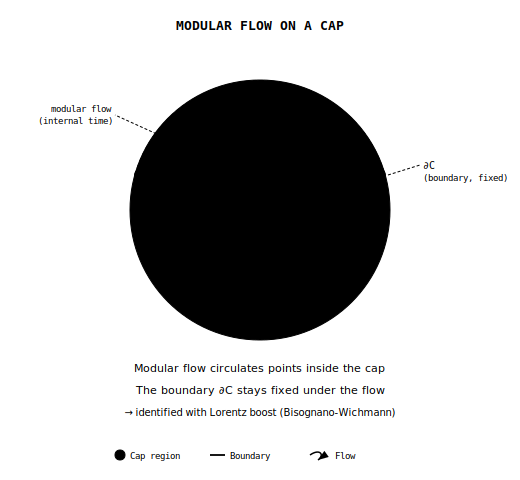

# Chapter 15: Relativity from Modular Time

## 15.1 The Intuitive Picture: Absolute Time and Newtonian Gravity

The intuitive picture is the Newtonian one. Time is universal and flows the
same everywhere. Space is a three-dimensional stage. Gravity is a force acting
at a distance.

This picture is simple and matches everyday experience. Synchronize watches with a friend and they stay synchronized. A room does not change shape as you walk across it. A falling apple is being pulled by the Earth.

Newton made this precise. In his *Principia* of 1687, he wrote: "Absolute, true, and mathematical time, of itself, and from its own nature, flows equably without relation to anything external."

Space was similarly absolute. A container that exists whether or not anything is in it. Objects move through space; space itself is fixed and unchanging.

This worldview worked spectacularly well for two centuries. It predicted planetary orbits, tides, the motion of comets. It launched the Industrial Revolution and put humans on the Moon.

Physics says otherwise.

## 15.2 The Surprising Hint: Light Refuses to Behave

### Maxwell's Equations

In the 1860s, James Clerk Maxwell unified electricity and magnetism into a single theory. His equations predicted electromagnetic waves traveling at a specific speed:

$$c = \frac{1}{\sqrt{\epsilon_0 \mu_0}} \approx 3 \times 10^8 \text{ m/s}$$

This was the speed of light. Maxwell had discovered that light is an electromagnetic wave.

$c$ is the speed of light in vacuum. $\epsilon_0$ is the electric permittivity
of free space, and $\mu_0$ is the magnetic permeability of free space. Maxwell
did not put light into the theory by hand. The wave speed fell out of the
electric and magnetic constants and matched the measured speed of light.

But there was a puzzle. Speed relative to what?

### The Aether Hypothesis

Physicists assumed light must propagate through a medium, just as sound propagates through air. They called this medium the "luminiferous aether." It filled all space and provided the reference frame in which Maxwell's equations held.

If the aether exists, the Earth should be moving through it. As the Earth orbits the Sun at 30 km/s, we should be able to detect an "aether wind." Light traveling into the wind should be slower than light traveling with it.

### The Michelson-Morley Experiment

In 1887, Albert Michelson and Edward Morley built the most sensitive optical instrument of its time; chapter 1 described the sandstone slab floating in mercury in their Cleveland basement. They split a light beam in two, sent the halves in perpendicular directions, reflected them back, and recombined them.

If the aether existed, light traveling parallel to Earth's motion would take a different time than light traveling perpendicular. The recombined beams would be out of phase. Interference fringes would shift as the apparatus rotated.

They found nothing: no shift, no aether wind.

The experiment was repeated with increasing precision for decades. The result never changed. The speed of light is the same in all directions. There is no aether.

### The Crisis

Maxwell's equations predicted one definite speed for light, and nothing was left for that speed to be relative to.

Lorentz and FitzGerald proposed that objects physically contract in the direction of motion, exactly canceling the expected time difference. This "length contraction" hypothesis saved the appearances but seemed ad hoc.

The crisis demanded resolution. It came from a patent clerk in Bern.

## 15.3 Einstein's Revolution

### The Two Postulates

In 1905 the clerk was twenty-six, a technical expert third class who spent his
days at the patent office in Bern judging other people's inventions, among
them schemes for synchronizing distant clocks by electric signal. In June of
that year Albert Einstein sent Annalen der Physik a paper titled "On the
Electrodynamics of Moving Bodies." It cut through the confusion with two
simple demands. The laws of physics had to be the same in all inertial
frames, and light had to travel at the same speed in vacuum regardless of the
motion of source or observer.

The second postulate sounds impossible. If you're on a train moving at 100 km/h and throw a ball forward at 50 km/h, a stationary observer sees the ball moving at 150 km/h. Velocities add.

But light doesn't work that way. If you're on the train and shine a flashlight forward, both you and the stationary observer measure the light traveling at exactly c, not at c + 100 km/h.

### Time Must Give Way

Einstein realized that if the speed of light is constant for all observers, something else must change. That something is time itself.

Consider two events: a flash of light is emitted, and it hits a detector. The time between these events depends on the observer.

For an observer at rest relative to the apparatus, light travels a short distance. The time interval is t.

For an observer moving relative to the apparatus, the light travels a longer path (following the moving detector). But light speed is the same. So the time interval must be longer: t' > t.

Moving clocks run slow.

### The Lorentz Factor

The arithmetic runs through one factor. Define:

$$\gamma = \frac{1}{\sqrt{1 - v^2/c^2}}$$

This is the Lorentz factor. For everyday speeds, gamma is indistinguishable from 1 at ordinary precision. For v = 0.9c, gamma = 2.3. As v approaches c, gamma goes to infinity.

Here $v$ is the relative speed between inertial observers. The ratio $v/c$
measures that speed as a fraction of light speed. The square root in the
denominator is why nothing with mass reaches $c$: as $v$ approaches $c$,
$\gamma$ grows without bound.

Time dilation:

$$\Delta t' = \gamma \Delta t$$

A moving clock ticks slower by the factor gamma.

Length contraction:

$$L' = \frac{L}{\gamma}$$

A moving object is contracted in the direction of motion by the factor gamma.

### The Relativity of Simultaneity

The deepest consequence is subtler. Events that are simultaneous in one frame are not simultaneous in another.

If a train car is struck by lightning at both ends simultaneously (in the train frame), a stationary observer sees the front strike first. If the strikes are simultaneous for the stationary observer, the train passenger sees the rear strike first.

There is no absolute present. Simultaneity is relative.

## 15.4 Spacetime: The New Geometry

### Minkowski's Insight

In 1908, Hermann Minkowski, Einstein's former mathematics professor, recast special relativity as geometry. At a lecture in Cologne, he declared:

"Henceforth space by itself, and time by itself, are doomed to fade away into mere shadows, and only a kind of union of the two will preserve an independent reality."

Space and time are not separate. They are aspects of a single entity: spacetime.

### The Spacetime Interval

In ordinary geometry, the distance between two points is:

$$ds^2 = dx^2 + dy^2 + dz^2$$

This is invariant under rotations. Different observers who rotate their axes will disagree about x, y, and z individually, but they'll agree on ds.

In spacetime, the invariant quantity is:

$$ds^2 = -c^2 dt^2 + dx^2 + dy^2 + dz^2$$

Note the minus sign. Time enters with the opposite sign from space. This is Lorentzian geometry, not Euclidean.

Different observers disagree about t and x individually. But they all agree on ds. The spacetime interval is the fundamental invariant.

### The Light Cone

When ds^2 = 0, we have:

$$c^2 dt^2 = dx^2 + dy^2 + dz^2$$

This describes light rays. Light travels on the boundary of the light cone.

Events with ds^2 < 0 (more time separation than space separation) are "timelike separated." A massive particle can travel between them.

Events with ds^2 > 0 (more space separation than time separation) are "spacelike separated." Nothing can travel between them. They are causally disconnected.

The light cone is the same for all observers, so causality is preserved even
when simultaneity is not.

## 15.5 Evidence for Special Relativity

Special relativity is one of the most precisely tested theories in physics, and the tests come from unrelated directions: cosmic rays, particle accelerators, navigation satellites.

### Muon Decay

Muons are unstable particles created when cosmic rays hit the atmosphere. Their mean lifetime is 2.2 microseconds. Traveling at nearly light speed, they should decay long before reaching the ground.

But they don't. Time dilation stretches their lifetime. From our perspective, the muons' clocks run slow, so they live long enough to reach detectors at sea level.

From the muons' perspective, length contraction shrinks the atmosphere. They don't live longer; they just have less distance to travel.

Both perspectives are consistent. Both give the same answer. Muons reach the ground.

### Particle Accelerators

At the Large Hadron Collider, protons are accelerated to 0.999999991c. Their Lorentz factor is about 7,500. Their total energy is increased by the same factor relative to their rest energy.

If special relativity were wrong, the accelerator wouldn't work. The particles would behave differently than predicted. They don't. Special relativity is confirmed every second the LHC operates.

### GPS Satellites

The Global Positioning System requires timing accuracy of nanoseconds. GPS satellites orbit at high speed (time dilation makes their clocks run slow) and at high altitude (gravitational time dilation, which we'll discuss shortly, makes their clocks run fast).

Without relativistic corrections, GPS would accumulate errors of 10 kilometers per day. It works because the corrections are applied. Every time you use GPS, you're confirming Einstein. Your phone corrects for the curvature of spacetime several times a second and has never once been thanked for it.

## 15.6 General Relativity: Gravity as Geometry

Special relativity describes uniform motion. But what about acceleration? What about gravity?

### The Equivalence Principle

Einstein's breakthrough came from a simple observation. In a falling elevator,
you float weightless. You cannot tell the difference between falling in a
gravitational field and floating in empty space.

Conversely, standing on Earth feels exactly like accelerating upward at 9.8 m/s^2. You can't tell the difference.

This is the **Equivalence Principle**: gravity and acceleration are locally indistinguishable.

Einstein called this "the happiest thought of my life."

### The Elevator Thought Experiment

You are in a windowless elevator. Either it is sitting on Earth or it is accelerating upward through empty space. How would you tell the difference?

You drop a ball. It falls. Is it being pulled by gravity, or is the floor accelerating up to meet it?

You can't tell. The two situations are physically equivalent.

Send a beam of light across the elevator horizontally. If the elevator is accelerating upward, the light's path curves downward relative to the floor. The light "falls."

By the equivalence principle, light must also bend in a gravitational field. Gravity affects light.

### Curved Spacetime

Light, though, is supposed to travel in straight lines. If it bends near massive objects, maybe "straight" isn't what we think.

Einstein's radical proposal was that massive objects curve spacetime itself. Light travels along the straightest possible paths. But in curved spacetime, the straightest paths are curves.

A geodesic is the straightest path in a curved geometry. On a sphere, geodesics are great circles. On Earth, the shortest flight from New York to London curves north over the Atlantic.

In curved spacetime, planets don't orbit the Sun because of a force. They're following geodesics in the curved geometry created by the Sun's mass. They're going as straight as they can, but the space around them is bent. A planet is falling toward the Sun at every moment and, on account of its sideways speed, perpetually missing.

### The Einstein Field Equations

Einstein spent years developing the mathematics. The result, published in 1915:

$$G_{\mu\nu} + \Lambda g_{\mu\nu} = \frac{8\pi G}{c^4} T_{\mu\nu}$$

On the left: the Einstein tensor G, which describes the curvature of spacetime, plus a cosmological constant term.

On the right: the stress-energy tensor T, which describes the distribution of matter and energy.

The indices $\mu$ and $\nu$ label spacetime directions. $g_{\mu\nu}$ is the
metric, the object that tells spacetime how to measure intervals. $G_{\mu\nu}$
is built from the curvature of that metric. $\Lambda$ is the cosmological
constant. $T_{\mu\nu}$ is the stress-energy tensor. The coefficient
$8\pi G/c^4$ sets the strength of gravity in ordinary units.

John Wheeler summarized it: "Spacetime tells matter how to move; matter tells spacetime how to curve."

### Gravitational Time Dilation

Clocks run slower in stronger gravitational fields. This is gravitational time dilation.

At sea level, clocks tick slightly slower than at mountain tops. The effect is tiny but measurable. GPS satellites must correct for it.

Near a black hole, the effect is extreme. From far away, a clock falling toward the event horizon appears to slow down and freeze. The clock never seems to cross the horizon.

From the clock's perspective, nothing special happens at the horizon. It falls right through. But signals it sends take longer and longer to escape, until they can't escape at all.

## 15.7 Evidence for General Relativity

### The Precession of Mercury

Mercury's orbit precesses: its closest approach to the Sun slowly rotates around the Sun. Newton's theory couldn't fully explain this. There was a discrepancy of 43 arcseconds per century.

Einstein's equations predicted exactly this amount. It was the first confirmation of general relativity.

### Light Bending

Einstein predicted that starlight passing near the Sun would be deflected by 1.75 arcseconds. In May 1919, Arthur Eddington sailed to Príncipe, an island off the west coast of Africa, and photographed the Hyades through a gap in the clouds during a total eclipse. The stars near the Sun appeared displaced.

The 1919 result was historically decisive, and later measurements confirmed the effect far more precisely. The Times of London announced: "Revolution in Science. New Theory of the Universe. Newtonian Ideas Overthrown."

### Gravitational Waves

In 2015, the LIGO detectors observed gravitational waves for the first time. Two black holes, each about 30 solar masses, spiraled together and merged. The resulting gravitational waves stretched and compressed space itself.

The signal matched Einstein's predictions within the measured uncertainties. A
century after he wrote down the equations, ripples in spacetime were detected.

### Black Holes

General relativity predicts that sufficient mass concentrated in a small enough region creates a black hole: a region from which nothing, not even light, can escape.

In 2019, the Event Horizon Telescope photographed the shadow of the black hole at the center of galaxy M87. In 2022, they imaged Sagittarius A*, the black hole at the center of our own galaxy.

Black holes exist, and the observed strong-field data match general relativity extremely well in tested regimes.

## 15.8 Recovering Special Relativity from the Screen

The account above is the standard story, told the standard way. The question
for this book is different: sit a federation of finite observers on the
screen and ask what comparisons they can consistently make. Relativity should
fall out as the answer, or the framework is in trouble.

The route begins with a finite object and has to clear several checks along
the way, each one a change in the kind of mathematical object being handled.
The twelve-port icosahedron is the local instrument panel. A repaired
federation supplies the candidate spherical support only under a
source-bound, refinement-natural federation-to-support map, and that map is
work in progress. On the supported branch, the conformal symmetry of the
smooth sphere supplies Lorentz kinematics. Hyperbolic three-space then labels
possible rest frames. Events, positions, and a four-dimensional spacetime
require a further construction.

### From Modular Ordering to an Observer Clock

The modular-time construction begins with the ordering carried by modular flow.
At finite cutoff, or in the special representations that admit density
matrices, an observer patch $P$ has a reduced density matrix. Its support region is displayed as a cut of the holographic
screen, and the density matrix defines a modular Hamiltonian:

$$K_P = -\ln \rho_P$$

This Hamiltonian generates a flow:

$$\sigma_t(A) = e^{iKt} A e^{-iKt}$$

This modular flow gives the patch an intrinsic one-parameter ordering. Here
$A$ is any observable the patch can ask about. The formula says how that
question changes along the flow.

$\rho_P$ is the reduced density matrix for patch $P$. The logarithm turns the
state into its modular Hamiltonian $K_P$. The map $\sigma_t$ is the modular
evolution, and $t$ is its dimensionless parameter. The exponentials are the
operator version of changing a question by flowing it forward and then back.

In the continuum limit this operator formula is not always the right target.
Continuum algebras can stop admitting density matrices altogether, so there
may be no operator $K=-\log\rho$ inside the cap algebra. The more general OPH
statement is about the modular automorphism group itself: the whole flow of the
cap's observable algebra, read on the geometric cap pair.

### Geometric Modular Flow on Caps

Consider a cap $C$ on the sphere $S^2$. In the smooth regime, the cap's
modular ordering can become identifiable with a motion on the sphere. This is
where the construction turns toward relativity. The flow becomes the same
kind of geometric transformation that later appears as a boost. It does not
measure a duration by itself.

When the geometry is under enough control, the cap's modular flow can match a
smooth dilation of the sphere. Matching the two means fixing which side of the
cap you mean, which orientation, and which independently normalized geometric
parameter you are comparing against, while the same refinement tower
independently carries the complete algebra-state comparison package.

When the cap is extracted cleanly, its flow is carried through refinement
without distortion, the round caps are rigid, the geometric normalization is
fixed, and the independent algebra-state package holds on the same tower, the modular
automorphism and geometric dilation are the same operation on the support
algebra. Finite cells supply the regulator; their controlled smooth limit
supplies the continuous boost.

The icosahedral $A_5$ frame belongs on that finite side. It organizes twelve
ports and gives a highly isotropic regulator, but its sixty rotations are not
Lorentz transformations. Lorentz symmetry comes from the full conformal group
of the smooth observer-facing sphere after the modular and refinement checks
pass. The polyhedron is the finite instrument panel. The round sphere is the
continuum kinematic chart.

On the certified branch, a closed spherical support, a well-behaved mesh,
matching cross-ratios (a distance-free way to compare four points), and the
modular temperature scale produce the round sphere and its full conformal
structure. The observer-facing map then localizes records and turns that
conformal structure into the shared kinematic chart. The finite federation
has to produce those inputs independently; a mesh drawn by the analyst cannot
stand in for them.

The state supplies modular flow, and the recovered metric supplies proper
time along a worldline. Before the flow parameter counts as a physical clock
reading, an observer-readable transition, an event correspondence, and a
stated calibration have to be supplied. Comparing two different worldlines
needs one more piece: a rule saying which event on one clock corresponds to
which event on the other. A local Lorentz factor compares velocities at one
event; it is not a global clock-conversion formula. Consistent overlap
calibrations then let the local clocks assemble into one spacetime
description.

{width=78%}

### Conformal Symmetry Is Lorentz Symmetry

The mathematical fact is that the group of orientation-preserving conformal
transformations of $S^2$ is

$$\text{Conf}^+(S^2) \cong PSL(2, \mathbb{C}) \cong SO^+(3,1)$$

The conformal group of the sphere is isomorphic to the Lorentz group.

This is the main reason the sphere is the right observer-facing chart. It gives
each observer a celestial sky, it gives local caps whose modular flows can
become geometric motions, and it gives the exact symmetry group that relativity
uses to compare inertial observers.

The precise proof uses null rays and oriented caps, but the picture is simple:
a cap on the sky marks a side of the observer's celestial screen. It helps
define cuts and half-spaces in the recovered spatial chart. It is not itself
the observer's position.

$\text{Conf}^+(S^2)$ is the orientation-preserving conformal group of the
two-sphere. $PSL(2,\mathbb C)$ is the projective special linear group acting
by Moebius transformations. $SO^+(3,1)$ is the proper orthochronous Lorentz
group, the part of the Lorentz group connected to ordinary rotations and
boosts. The symbol $\cong$ means "is isomorphic to": the groups have the same
structure even though they are written in different languages.

Moebius transformations of the complex plane (which is the Riemann sphere S^2) are exactly Lorentz transformations of the celestial sphere that a relativistic observer sees.

A conformal transformation preserves angles while allowing local scale to
change. The Lorentz group preserves the light-cone structure of spacetime. The
isomorphism says these are the same symmetry written in two languages: angle
preservation on the celestial sphere and relativistic frame changes in
spacetime.

Lorentz kinematics is recovered when the observer-facing cap net reaches the
controlled geometric scaling branch, the cap modular automorphism acts as
a real geometric motion, and the rigidity hypotheses identify that motion with
the conformal action.

The same step fixes the dimension of the observer-frame space. A rest observer
is represented by a future timelike direction. The
Lorentz group can move that direction, while ordinary rotations leave it
fixed. The frame space is therefore the quotient

$$H^3 = SO^+(3,1)/SO(3)$$

The Lorentz group has six generators. Rotations use three of them. The quotient
leaves three boost directions, so the frame space has dimension $6-3=3$.
Its points are future unit timelike frames. They are not positions in space.

A cap is not an observer point. Observer data, such as a clock, a carried set
of reference axes, or a stable record frame, select a frame value in this
fiber. The fiber's overall physical scale is a separate gravity-branch
question.

Reading a frame out of records is a separate step. A record picks out a frame
only when its measured cap responses fit the frame model with every source of
error accounted for. Finite noisy data then deliver either a small ball of
frames guaranteed to contain the right one, or a plain admission that the
data cannot decide. A spacetime event needs another construction: affine
event coordinates, coincidence, causal ancestry, a quadratic cone with one
timelike direction, and compatible charts. The celestial sphere checks the
boundary of that cone; it does not determine the cone by itself.

### Why There Is No Privileged Reference Frame

A natural worry about OPH lands here.

If reality is encoded with a screen chart carrying finite local degrees of
freedom, why isn't there a "God's eye view" of the whole chart? Wouldn't that be
a privileged reference frame?

**There is no observer outside the screen net.** The sphere
is the symmetric chart for observer-facing support data, with no
external inspection platform above it. OPH does not include any
external vantage point. Observers have no user seat outside the computation.
They are operational patterns within the finite patch federation, visible
through the screen chart.

Think about what an observer actually is in OPH. It is a bounded patch or
connected subfederation with a local algebra and state, internal readback,
rereadable records, exposed interfaces, record-conditioned updates, and
checkpoint continuation. Nothing in that list names the particular patch the
pattern happens to be running on. Stability of one correlation pattern is
useful, but it is not the whole observer test. The support chart displays that operational
domain as $P_O \subset S^2$. No observer can access the entire screen net
simultaneously. A global state $\omega$ may exist in a mathematical model, but
no entity within OPH can inspect it as a private object.

Consider two observers with overlapping patches. Each has a modular flow, a
local clock. When their descriptions are compared, the admissible
transformations have to map patches to patches, preserve the overlap
structure, and avoid turning any one patch into the privileged center of the
world. A natural symmetry group that does that is the conformal group of
$S^2$, and $\text{Conf}(S^2)\cong \mathrm{SO}(3,1)$ is the Lorentz group.

On the spherical branch, Lorentz invariance is the symmetry class
relating observer perspectives without privileging any one of them.

**Carrier coordinates do not need to move through a pre-given bulk.** What we
call motion in emergent 4D spacetime is a stable change in the relations
visible in the shared public description, together with the localized
records. Its quantum representation, dynamics, and
pole give the corresponding particle. A Lorentz boost relates
how two observers describe the same localized pattern in the smooth chart.

The carrier does not sit at a hidden coordinate inside the spacetime it helps
produce. Spacetime emerges from those publicly visible relations among
patches.
Carrier architecture nevertheless matters: changing port incidence,
orientation, state response, or refinement can change the relations that reach
the smooth limit. Asking which emergent inertial frame contains the carrier is
like asking what color the number seven is. Asking which carrier structure was
realized is a physical question.

### Why the Speed of Light Is Universal

Why is there a maximum speed, and why is it the same for everyone?

On the recovered geometric branch, the common causal structure on the screen
determines the effective light cone.

The speed of light $c$ is then the conversion factor between calibrated clock
readings and geometric distance in the emergent bulk description. It is
universal because all observers read the same conformal light-cone structure.

Different observers have different modular flows. On the geometric branch, the
inter-observer relations are carried by conformal transformations of $S^2$.
The Lorentz group is the corresponding symmetry of the shared causal structure.

On the event branch, repaired records can supply causal order, time separation,
and a common light-cone structure. Events are equivalence classes of record
germs under common refinement, rather than points borrowed from the frame
space. A dense population of separated events, open local charts, full-rank
frames, a quadratic cone with one negative direction, and consistent overlaps
reconstruct a four-dimensional spacetime with one time direction and three
spatial directions. The possible rest frames form a separate hyperbolic fiber
over each event.

## 15.9 Recovering General Relativity

On the certified geometry branch, special-relativistic kinematics emerges from
the conformal structure of the screen. What about gravity?

### How Patch Consistency Enters

Patch consistency does two jobs here. First, it forbids any preferred observer
or preferred frame. Second, once every observer shares the same local rest-frame
relation, patch consistency forces those local relations to knit together into a
single tensor law. The equilibrium state, the local modular ordering, and the
entropy balance across small regions together feed the tensor first-variation
relation. A common refinement domain, vacuum reference, coupling, and scale
described below supply the absolute equation.

The branches divide their work. Consensus supplies clean, agreed-upon records.
Geometric readout turns those records into caps, small causal diamonds, local
energy, frame information, and scale. Modular flow supplies an ordering
parameter; an independent observer instrument and calibration supply the clock.
The gravitational argument combines those outputs.

Two regions join across their shared boundary because correlations through the
intervening collar decay fast enough under refinement. One common family of
repaired records carries that decay together with the small-region remainder
bounds, so the finite joins converge to one smooth geometry.

### Jacobson's Insight (1995, 2016)

The thermodynamic route predates OPH. In 1995, Ted Jacobson showed that
Einstein's equations can be derived from thermodynamics. Horizon entropy scales
with area, heat becomes energy flux across a horizon, and temperature scales
with surface gravity. Demand that the first law hold for every local horizon
and Einstein's equation appears as the geometry required by that bookkeeping.

### What OPH Adds

OPH provides the selection rule that makes entanglement equilibrium
natural. The global state maximizes entropy subject to overlap consistency
constraints. On the realized cap-label-preserving MaxEnt family, admissible
fixed-cap variations satisfy

$$\delta S_{\text{gen}}(C) = 0$$

Entropy is stationary because the chosen state sits at the maximum
allowed by the local consistency data.

The word admissible carries the load. The cap, boundary sector, charges, and
declared constraint values are held fixed, apart from the stress-energy
perturbation channel. Hidden carriers, port labels, gauge presentations, and
repair schedules are not extra variation knobs in this theorem.

**The first law:** For a small cap C with generalized entropy:

$$S_{\text{gen}}(C) = \frac{\langle A \rangle}{4G} + S_{\text{bulk}}(C)$$

The first law relates entropy variation to modular energy:

$$\delta S_C = \delta \langle K_C \rangle$$

$S_{\text{gen}}(C)$ is the generalized entropy associated with cap $C$.
$\langle A\rangle$ is the expected area term, $G$ is Newton's constant, and
$S_{\text{bulk}}(C)$ is the entropy of the bulk quantum fields assigned to the
cap. The symbol $\delta$ means a small allowed variation. The equality says
that a small entropy change matches a small modular-energy change.

Once the controlled geometric construction has supplied the modular
automorphism, a finite-dimensional realization may be written as
$K_C = 2\pi B_C + Z_C$, where $B_C$ is the boost-energy part and $Z_C$ is the
sector bookkeeping. On that representation, the first law becomes:

$$\delta S_C = 2\pi \delta \langle B_C \rangle
+ \delta\langle Z_C\rangle$$

With that split, the accounting works even when the sector probabilities
shift; the bulk and boundary parts each keep their own ledger.

### The Stress Tensor Bridge

To get Einstein's equation, modular energy has to be connected to the stress
tensor. One route passes through a short-distance regime where the theory
looks scale-free, and there the modular Hamiltonian is explicitly local:

$$K = \int_\Sigma T_{ab} \zeta^b d\Sigma^a$$

where $\zeta$ is the conformal Killing field preserving the diamond.

The stress tensor is the local density and flow of energy and momentum. A
conformal Killing field is the infinitesimal motion that preserves the causal
diamond's conformal shape. This formula says the modular energy can be read as
ordinary local energy weighted by that geometric motion.

A second route works directly with null surfaces. A null surface is a
lightlike boundary, the kind followed by a light ray. On the OPH null bridge,
the renormalized half-line modular family fixes a positive null-translation
generator, and the same half-line derivative identifies that generator with
the local null-stress charge on that family. The same lightlike bridge then
feeds the bounded-interval kernel and tensor reconstruction used by the
framework.

{width=82%}

### The Einstein Equation

Combining the entropy variation with the geometric identity for area variation
at fixed volume, one obtains the first-variation Einstein relation in the same
local $d=4$ scaling regime. In four dimensions the small-ball area variation
used by the compact paper is

$$\delta A|_{V,\Lambda} = -\frac{4\pi \ell^4}{15}\,
\delta\!\left[(G_{ab}+\Lambda g_{ab})u^a u^b\right]+o(\ell^4)$$

Here $\delta A|_{V,\Lambda}$ is the small change of area while the small
diamond's volume and the metric-term convention are held fixed. $\ell$ is the
diamond's characteristic size, $u^a$ is the local rest-frame four-velocity,
$G_{ab}$ is the Einstein tensor, $g_{ab}$ is the metric, and $\Lambda$ is the
cosmological-constant term. The remainder $o(\ell^4)$ means smaller than
$\ell^4$ in the limit of small $\ell$. The formula says that the area
response of the local screen is controlled by the same curvature combination
that appears in Einstein's equation.

The equilibrium condition then compares that geometric response with the
matter-energy response:

$$\delta S_{\text{matter}}
= \frac{8\pi^2\ell^4}{15}\,
\delta\langle T_{ab}u^a u^b\rangle+o(\ell^4)$$

$$\delta\!\left(G_{00} + \Lambda g_{00}\right) = 8\pi G\,\delta\langle T_{00} \rangle$$

This holds in the rest frame of each small cap for admissible first variations.
$T_{00}$ is the local energy density, the angle brackets mean expectation
value, and the factor $8\pi G$ is the Newton normalization on the selected
gravity branch.

### Where Patch Consistency Actually Enters

Here the distinctive OPH move enters. Different observers through the same
bulk point carry different rest frames. The equilibrium argument gives the
first-variation relation in each of those frames. The branch must cover all
local timelike directions and reference states. Under that condition, the
scalar relations fit one common tensor first-variation law. If observer A and
observer B agree on the overlap physics, their frame-dependent equations have
to be shadows of

$$\delta\!\left(G_{ab} + \Lambda g_{ab}
- 8\pi G \langle T_{ab} \rangle\right)=0$$

This equation fixes the tensor relative to a reference value. It does not set
the integration tensor to zero. On an independently constructed refinement
family that keeps every quantity on the same domain, the
Ward identity, contracted Bianchi identity, metric compatibility, and
connectedness reduce the remaining local freedom to one constant metric term
per component. A declared vacuum reference evaluates that term. The absolute
semiclassical equation is then

$$G_{ab} + \Lambda g_{ab} = 8\pi G \langle T_{ab} \rangle.$$

The global capacity branch is a separate proposal for the numerical value of
\(\Lambda\); it does not replace the vacuum-reference premise.

The word "branch" names the division of labor. Finite consensus supplies the
repaired records. One refinement-compatible family then carries their geometry,
modular flow, events, stress, entropy, vacuum reference, and scale readouts on a
common domain. Every timelike rest-frame relation becomes the same tensor
equation. The contracted Bianchi identity, local stress conservation, metric
compatibility, and connectedness turn the local metric residue into one global
constant Lambda.

This is a conditional composition theorem. Finite consensus does not supply
the tower. Construction of an inhabited refinement family with all of these
readouts on a common domain is work in progress.

The lower-case indices $a,b$ again label spacetime directions. The angle
brackets around $T_{ab}$ mean expectation value: matter remains quantum, so
the geometry responds to the averaged stress-energy seen in the effective
state. This is why the equation is semiclassical. Geometry is classical in the
approximation, while matter retains quantum expectation values.

### The Derivation Chain

The chain is straightforward. MaxEnt selects the equilibrium state among
overlap-consistent configurations. Entanglement equilibrium gives the
thermodynamic relation in each local rest frame. Geometric modular flow turns
modular energy into physical energy. The stress-tensor bridge identifies the
energy content. Each observer reads the Einstein relation in their own frame,
and patch consistency forces those local readings into one tensor equation.

### Classical Mechanics from Emergent GR

Once the semiclassical Einstein relation is established, classical mechanics
follows in the same effective regime.

**Conservation laws.** The contracted Bianchi identity is geometric: $\nabla^a G_{ab} = 0$. Combined with the Einstein equation in the scaling regime, this implies stress-energy conservation: $\nabla^a T_{ab} = 0$. Energy and momentum are conserved because the geometry demands it.

**Geodesic motion.** For pressureless matter ("dust"), $T^{ab} = \rho u^a u^b$. Conservation gives $\nabla_a(\rho u^a u^b) = 0$. Working this out yields the geodesic equation: $u^a \nabla_a u^b = 0$. Free particles follow the straightest paths through curved spacetime. No additional postulate is needed. It follows from the Einstein equation in the same effective regime.

**Newton's laws.** In the weak-field, slow-motion limit, the Einstein equation reduces to Newton's gravitational law: $\nabla^2 \Phi = 4\pi G \rho$. Geodesic motion becomes $\ddot{\mathbf{x}} = -\nabla \Phi$. This is Newton's second law with gravitational force.

{width=82%}

So classical mechanics is a derived consequence. The familiar laws of motion and gravity emerge from the deeper framework when we consider the appropriate limit. Newton's physics remains valid in its domain and belongs to the effective level.

## 15.10 Why Emergent Gravity Works

If spacetime geometry emerges from information theory, why does general relativity work so well?

### The Hydrodynamic Limit

Think of water. At the microscopic level, it's a chaotic collection of molecules bouncing around. But at macroscopic scales, it flows smoothly. The Navier-Stokes equations describe this flow without reference to individual molecules.

Spacetime is similar. At the Planck scale, it is a quantum mess. But at macroscopic scales, the "molecules" average out. What remains is the smooth geometry of general relativity.

This is a hydrodynamic limit. The screen has an enormous number of degrees of freedom. Their collective behavior is captured by a smooth metric.

### Error Suppression

Corrections to general relativity scale as:

$$\left(\frac{\ell_P}{L}\right)^2$$

where L is the scale of interest and the Planck length is:

$$\ell_P = \sqrt{\frac{\hbar G}{c^3}} \approx 10^{-35} \text{ m}$$

For any macroscopic process, this ratio is absurdly tiny. General relativity is extraordinarily accurate for all practical purposes.

### The Best Compression

Emergent geometry is the most economical description of how calibrated
observer clocks and their supporting modular flows fit together.

Imagine collecting all the data about how every patch's modular flow and clock
readout relate to every neighboring patch. This is an enormous amount of
information.

But there's a compression. In the effective geometric regime, specifying a
metric $g_{ab}$ organizes the leading overlap relations between nearby modular
flows. The metric is the compressed description that captures that common
structure.

This compression comes after neutral reconstruction, which first gives
distances between features after redundant labels have been
identified. The geometry readout, modular bridge, fixed-cap stationarity,
small-ball area variation, and tensor-upgrade steps then upgrade the relevant
geometric data to spacetime dynamics.

General relativity is the natural effective dynamics associated with this compression. It is the simplest theory that respects the recovered structure.

## 15.11 What the Framework Resolves

These conventional physics questions have natural answers in OPH.

### The Planck Scale: Not a Mystery

In standard physics, people ask: "What happens at the Planck scale? Does spacetime break down?"

OPH replaces this question with a finite-carrier question. At fixed cutoff,
the microscopic description is a federation of bounded patch
algebras, interfaces, records, and repair maps. The holographic screen is its
observer-facing geometry chart. Spacetime geometry can therefore lose its usefulness
at small scales without the finite operational description becoming a smaller
piece of spacetime.

The Planck scale marks the handoff between two descriptions. Above it, smooth
geometry is the useful compression. At it, the exact finite algebras,
interfaces, and repair rules are the useful description. Refinement carries
their shared records into the smooth large-scale limit. No additional layer of
quantum foam is needed.

This is like asking "what happens to temperature below one molecule?" The question is malformed. Temperature is emergent. Below a certain scale, you switch to the microscopic description. The same applies to geometry.

### The Cosmological Constant: Not a Problem

The "cosmological constant problem" assumes quantum field theory is fundamental. QFT predicts vacuum energy 10^120 times larger than observed. Something must cancel it.

QFT is an effective description of observer-facing patch dynamics. The effective
cosmological constant is tied to the reference
curvature and global screen capacity discussed in Chapter 13 through
dimensionless products such as $\Lambda\ell_\star^2$. In natural units, the
Gibbons-Hawking entropy is $S = A/(4G)$. For the late-time de Sitter horizon,
after the OPH scale branch is expressed in SI units, this gives a bare
radius-squared ratio near $1.05\times10^{122}$ and an entropy capacity near
$3.31\times10^{122}$.

The "problem" exists only if you compute vacuum energy using QFT and assume
that calculation is fundamental. OPH proposes a dimensionless global-capacity
relation. The numerical SI value of Lambda also needs the selected scale that
connects the screen units to laboratory units, rather than a local QFT
vacuum-energy sum. QFT vacuum fluctuations are emergent phenomena, not
fundamental contributions to the stress tensor.

In OPH the small value of Lambda belongs to a conditional global
capacity-closure branch rather than to a cancellation between enormous local
vacuum-energy terms. The finite capacity definition is exact; its physical
attachments are work in progress, and under them the selected de Sitter
capacity and scale display Lambda in laboratory units.

### Black Hole Information: Screen Encoding and Recoverability

In the microscopic description, the publicly visible data live in the
finite patch federation and are displayed through the screen chart. The bulk,
including black hole interiors, is emergent.

That changes the bookkeeping. The structure at the boundary blocks any clean split of the world into an independent inside and an independent outside. The recovery bound from Chapter 7 supports a stronger reading: in the controlled regime, the interior can be reconstructed from the outside together with the escaping radiation, so it is encoded on the outside rather than sitting there as a separate piece of the fundamental description.

This is the sense in which OPH softens the information paradox. The controlled
boundary bookkeeping does not require an autonomous bulk-interior store.

Information belongs to the observer-visible patch and boundary bookkeeping.
The interior is encoded rather than stored
in a second independent vault. Page curves and islands show the same lesson in
the cleanest holographic examples.

## 15.12 Dark Sector: Repair-Charge Response

### The Problem

Galaxies rotate faster than their visible matter predicts. Lensing, clusters,
the cosmic microwave background, and structure growth extend the discrepancy
beyond rotation curves.

The standard response is dark matter, a new weakly interacting particle that clumps around galaxies and provides the missing mass. Decades of searches have produced no confirmed new particle.

Modified Newtonian dynamics, or MOND, changes the low-acceleration law. It fits
many galaxy rotation curves but does not by itself supply relativistic lensing,
cluster stress, or cosmological perturbations.

### The Repair-Charge Medium

OPH's candidate is a medium of repair charge. Its local state is a number and
an angle, the occupation count and the phase of a rotor that can spin up in
whole units. The medium has two phases. In the normal phase it behaves like
dust, pressureless matter that clumps and gravitates, which is what cosmology
needs at large scales. In the condensed phase, reached where gravitational
gradients run deep, the medium changes the effective force law. For a roughly
spherical galaxy the condensed phase gives the deep-field relation

$$a_R=\sqrt{a_b a_0},$$

where $a_b$ is the ordinary baryonic pull and $a_0$ is a tiny acceleration
scale, about one ten-billionth of Earth gravity, below which rotation curves
misbehave.

Because the count and the angle enter one action, the medium carries a
conserved relativistic stress rather than a fitted force rule. The dust-like
phase controls abundance and the growth of structure. The condensed phase
controls lensing, gravitational slip (light and matter bending differently),
cluster interiors, the quiet Solar System, and the deep-galaxy acceleration
law.

## 15.13 Reverse Engineering Summary

The old picture treated time as universal, gravity as a force, and geometry as
a fixed stage. Relativity overturns each part. The speed of light forces time
and distance into one four-dimensional structure. Free fall reveals gravity as
geometry. OPH pushes the logic one step deeper. On the controlled scaling
branch, Lorentz symmetry becomes the geometry of how calibrated clock records
and modular cap motions mesh across patches, the separate event construction
gives one time and three spatial directions, and gravity
becomes the fixed-cap equilibrium condition after the geometry readout,
null bridge, bounded-interval kernel, small-ball area identity, and tensor
upgrade have all been supplied.

On this reading, the speed of light is the conversion factor between
information flow on the screen and emergent geometry in the bulk. On the
Einstein branch, Einstein's equation is
the public face of entanglement equilibrium written in the language of
curvature.

Newton's absolute time and space were beautiful ideas, and they served for
two centuries. They turned out to be approximations, the large-scale reading
of something deeper.

This yields emergent spacetime with Lorentz kinematics and
the Einstein relation on the stated scaling branch. Spacetime and particles
both emerge from the screen. What is matter inside that picture, and how do
classical notions of particle, energy, and motion grow out of the deeper
quantum structure?

That's the question of **Chapter 16: Matter, Motion, and Classical Physics**.
