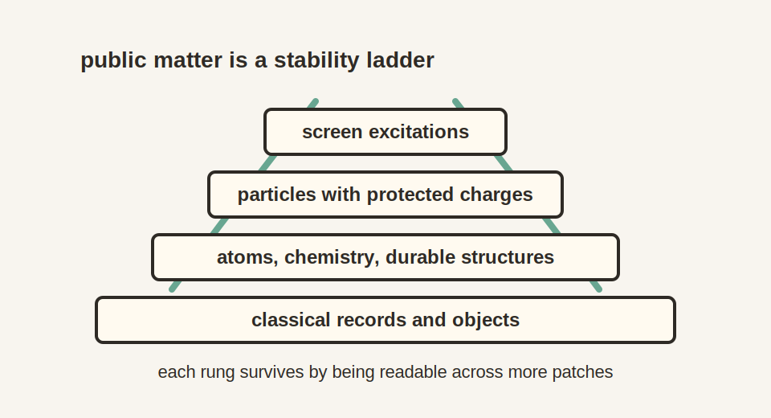

# Chapter 16: Matter, Motion, and Classical Physics

In 1909, alpha particles fired at a sheet of gold foil in Manchester came
bouncing back. Rutherford called the result as incredible "as if you fired a
15-inch shell at a piece of tissue paper and it came back and hit you." The
only architecture that survived the recoil was a tiny, dense nucleus in a
vast emptiness. Probed hard enough, matter keeps turning out to be structure
rather than stuff. This chapter follows that lesson to the bottom.

## 16.1 The Intuitive Picture: Matter Is Stuff, Motion Is Force

{width=78%}

The common-sense picture most of us grew up with is easy to state.

Matter is made of tiny objects moving around in space. Each object has a
position and velocity. Forces push them, pull them, and bend their paths.
Energy is a kind of fuel that keeps the motion going.

In this view, the world is a stage (space), time ticks forward, and matter is
the cast. Classical physics is the script: Newton's laws, conservation of
energy, and the principle of least action.

The picture passes every test daily life can devise. It is almost, though
not quite, entirely adequate. So why not take it as fundamental?

## 16.2 The Surprising Hint: The Classical World Is Not Fundamental

Quantum physics breaks the intuitive picture in three directions at once.
Particles do not follow single definite paths in the double-slit experiment.
Fields are more basic than particles, because the same electron can be
created and destroyed. Energy generates time
evolution and joins momentum inside one relativistic structure. The hint is
clear. The classical picture is an emergent approximation. The real question
is why it works so well.

## 16.3 The First-Principles Reframing: Matter as Stable Patterns

On the physical field-theory branch, **matter is a stable pattern in the finite
patch federation**.

Think of the carrier network as a high-resolution quantum information medium,
displayed to its internal observers through a screen chart. Most patterns are
noisy and ephemeral. Candidate particle patterns survive overlap consistency
and can be stitched across real patch interfaces when the records leave one
clear track. A positive-energy quantum construction and a detector-coupled
pole decide which candidates propagate as physical particles.

Matter, in this reading, is the set of durable, localized excitations of the
patch-algebra net, shown through the observer-facing screen chart. Nothing in
that sentence is a primitive substance, and nothing in it is a tiny billiard
ball.

A ripple crossing a pond is the right picture. The water is the substrate;
the ripple is a pattern that moves, interacts, and keeps its identity without
owning any fixed set of water molecules. Particles play the same role in the
emergent effective theory.

Everything in this chapter is the pattern layer; attaching it to measured
particles is work in progress, and the synthesis chapter keeps the ledger.

## 16.4 From Stable Patterns to the Particle World

Stable-pattern language earns its keep only where the familiar particle
families enter the chain. This is the point where the zoo stops looking like
a zoo.

Symmetry supplies the organizing principle. Once Lorentz kinematics is
recovered, durable excitations are sorted by mass, spin, and helicity. Stable
charge sectors reconstruct the compact gauge structure. The economy rule, which selects the smallest admitted packet,
then gives a conditional Standard Model quotient
$SU(3)\times SU(2)\times U(1)/\mathbb Z_6$, its charge pattern, a three-color
carrier, and the conditional minimum $N_g=3$. The physical family attachment
is work in progress.

This chain inherits the collective history of particle physics. Rutherford's
recoil opened it. Chadwick found the
neutron. Anderson saw the positron. Yukawa predicted a meson-like carrier of
the nuclear force. Gell-Mann and Zweig organized hadrons into quarks. Glashow,
Weinberg, and Salam gave the electroweak theory. Gross, Wilczek, and Politzer
explained asymptotic freedom. The Higgs mechanism was built by several groups,
and the LHC collaborations turned it into a discovery. OPH enters after that
century of work. Its question is why the ladder has this shape.

The force carriers enter first. The unbroken electromagnetic direction has two
transverse photon modes. The eight color directions carry the gluons. The
smooth gravitational branch has two transverse gravitational-wave modes. The
Higgs field changes the weak sector by selecting a vacuum direction, which
separates the charged $W$ carriers from the neutral $Z$ carrier and gives them
mass. The electroweak calculation places their running coordinates at

$$
(m_W^{\mathrm{chart}},m_Z^{\mathrm{chart}})
=(80.330,\ 91.119)\,\mathrm{GeV}.
$$

$m_W^{\mathrm{chart}}$ and $m_Z^{\mathrm{chart}}$ name the charged and neutral
weak-force coordinates. A GeV is a billion electronvolts, used as a mass unit
through $E=mc^2$. The calculation produces those two coordinates. Their
promotion to predictions needs several attachment steps that are work in
progress.

The strength of electromagnetism turns out to be readable off the screen's
geometry, for a reason the book holds until it can be stated properly.

The counting underneath the weak hierarchy has a simple shape. The Standard
Model gauge algebra has $8+3+1=12$ directions. Pairing each formal direction
with an orientation label gives the register count

$$
m_{\rm rep}=2(8+3+1)=24.
$$

The icosahedral carrier boundary has twelve ports and twenty-four oriented
slots, matching that count. Whether the match is physics or coincidence turns
on constructing the current that would tie gauge directions to ports, and
that construction is work in progress. The Higgs and top occupy a linked
critical balance inside the same quantitative structure.

Where can a three-place family candidate come from? The icosahedron supplies
one with its faces. Its twenty outward faces form one symmetric orbit. The subgroup
that leaves one face in place rotates its three corners, so every face carries
the same local three-step dial. A Hermitian response that respects this cycle
has the circulant form

$$
C=aI+bR+\overline bR^2,
$$

where $I$ is the identity, $R$ advances one corner, $a$ sets the response the
three corners share, and $b$ sets how they differ. A circulant is a matrix
whose rows are all the same list, rotated one step each row. The icosahedral
action carries the same unordered spectrum from face to face. The sixty
face-corner flags are the local copies of this dial, and the economy
selection leaves a canonical three-slot candidate band. The face triplet and
the color triplet of $SU(3)$ do different jobs; their shared use of the
number three comes from different parts of the architecture. Tying the face
triplet to the three observed generations is work in progress.

In 1981 Yoshio Koide wrote down a formula tying together the masses of the
electron, muon, and tau. It fit the tau mass before precision measurements
confirmed it, and nobody knew why it should hold. The face geometry offers an
answer. Read the three eigenvalues as square roots of the charged-lepton
masses, let the record balance fix how much the three share against how much
they differ, and the resulting angle gives
the Koide value

$$
Q=\frac{m_e+m_\mu+m_\tau}
        {(\sqrt{m_e}+\sqrt{m_\mu}+\sqrt{m_\tau})^2}
=\frac23.
$$

An eight-register finite model realizes this write-and-verify cycle with
bounded local state, ports, readback, repair moves, and durable accepted or
rejected records. It is
an observer-like self-reading charged-family control. The geometry supplies the
three-cycle and the record layer selects a stable response. Identifying its
three eigenmodes with the physical electron, muon, and tau is work in
progress.

If the physical construction selects the same global family triplet, it
carries the quarks and neutrinos. The six quark flavors, up, down, strange,
charm, bottom, and top, need six Yukawa coordinates at one common scale,
three up-type and three down-type. Their values run with energy as gauge and
Higgs interactions dress the underlying family response.

Running means the quoted mass depends on the energy scale at which the quark is
probed. This is normal in quantum field theory. It is why a quark mass in a
short-distance table is not the same kind of number as a proton mass measured in
the lab: the proton is a bound state, and most of its mass is the confinement
energy of the quarks and gluons inside it.

On that conditional attachment, neutrinos use the same three-family space in
a different basis: electron, muon, and tau name flavor directions,
$m_1,m_2,m_3$ name mass directions, and the PMNS matrix is the rotation
between those two descriptions.

### Why the Universe Contains More Matter Than Antimatter

Every recipe above produces matter and antimatter in equal amounts, and
equal amounts annihilate. Run that forward and the universe ends as a thin
bath of light with nobody in it. Something tipped the balance by roughly one
part in a billion, and that tip is the reason there are galaxies, chemistry,
and readers.

In this framework the tip comes from the record layer. The repair current
that keeps records consistent carries a phase, a winding that tells a history
apart from its mirror image. That phase attaches to the combined baryon and
lepton charge that sphalerons can change; a sphaleron is a high-temperature
process that can convert one kind of charge into another. The winding biases
those conversions in one direction. As the universe cools, the biased
conversions leave a small surplus of matter behind, and freeze-out locks the
surplus in. The Standard Model's own sixfold phase cannot do this job; it
only identifies duplicate color, weak, and hypercharge transformations, and
the record phase supplies the extra direction the excess needs.

## 16.5 What Is a Particle?

A particle, at this layer, is the stable way an excitation shows up under
the symmetries of the world. Wigner taught physics to catalogue those recurring
roles by mass and spin, and OPH inherits the same catalogue once Lorentz
kinematics emerges from screen dynamics.

Sector or family identity answers what kind of particle a pattern is. Token
continuity answers whether two detector records belong to one continuing
particle. Calibrated cap responses localize each record, a shared clock orders
the records, and compatible charge transport carries the excitation across the
interface. The track that fits every overlap becomes the particle's worldline.

Mass tells you how the excitation answers time translations. Spin tells you how
it answers rotations. Once Lorentz symmetry is in place, energy and momentum
lock into a single four-vector and mass becomes the invariant. The
familiar relation

$$E^2 = p^2 + m^2$$

is symmetry speaking. Particles are universal because those
symmetry roles are universal.

This formula uses natural units with $c=1$. $E$ is energy, $p$ is momentum,
and $m$ is rest mass. In ordinary units the relation reads
$E^2=p^2c^2+m^2c^4$. The compact version is used because the chapter is
tracking the symmetry structure, not converting units.

## 16.6 What Is Energy?

Energy is the price a pattern pays to keep unfolding through time. In this
framework, modular flow first supplies a candidate generator. Once geometry and
a calibrated observer clock identify that generator with time translation, its
conserved charge becomes physical energy. Far enough out in the effective
world, this is the ordinary Hamiltonian language and the stress tensor familiar
from field theory.

The Hamiltonian is the operator that generates time evolution. The stress tensor
is the field-theory object that records where energy and momentum are and how
they flow.

Energy conservation survives the translation because once the emergent action
respects time shifts, the usual conserved charge follows with it. The deep
explanation changes. The operational behavior does not.

## 16.7 Motion and Forces: Why Things Move the Way They Do

Classical motion can be described in two equivalent languages. One uses force
laws such as $F = ma$. The other uses variational laws in which trajectories
extremize an action. Both are effective descriptions. Motion is a property of
stable patterns moving under modular flow, observed consistently across
patches. Forces describe how those patterns interact within the emergent effective field theory.

**Locality and consistency constrain motion.** Overlaps
force observers to agree on what happened. The Markov structure enforces local
relations between neighboring regions. These requirements leave very little
freedom in the form of effective equations of motion.

The broad shape of the low-energy laws is set by the same consistency
structure that gives us gauge symmetry in Chapter 14. The exact
coupling-by-coupling account is carried by the quantitative particle and
gravity picture built in the surrounding chapters.

## 16.8 Why the Principle of Least Action Appears

The principle of least action can sound mystical, but it is a direct
consequence of quantum interference.

In quantum mechanics, the probability amplitude for a particle to go from
A to B is a sum over all possible paths:

$$\mathcal A \sim \sum_{\text{paths}} e^{i S/\hbar}.$$

Here the action is

$$S = \int L(q, \dot q, t)\,dt,$$

where $L$ is the Lagrangian.

The Lagrangian is the local rule that weighs motion. Roughly, it records the
balance between kinetic and potential contributions along a candidate path.

When the action $S$ is large compared to $\hbar$, phases oscillate rapidly and
cancel out. Only paths where $S$ is stationary survive. This yields the
Euler-Lagrange equations:

$$\frac{d}{dt}\left(\frac{\partial L}{\partial \dot q}\right) = \frac{\partial L}{\partial q}.$$

The "least action" rule is the classical limit of quantum consistency. The
effective action carries that consistency into the low-energy field theory, and
the stationary-action description follows in the semiclassical limit.

The coordinate $q$ is the generalized position of the system, and $\dot q$ is
its time derivative, the generalized velocity. The partial derivatives ask how
the Lagrangian changes if position or velocity is varied while the other
quantity is held fixed. The Euler-Lagrange equation is the compact rule that
selects the path whose action is stationary.

Historically it is called "least" action, but what really survives is
**stationary** action: small variations do not change the path to first order.

## 16.9 The Classical Limit: Why the World Looks Deterministic

Classical physics is an emergent approximation. It appears when the action is
large compared to $\hbar$, when the system is strongly entangled with its
environment, and when observers coarse-grain over microscopic details.

### Why Decoherence Matters for Consistency

Decoherence is essential to OPH. It is part of what makes a stable shared classical description possible, not a lucky accident bolted on afterward.

The overlap condition demands that observers agree on shared observables.
Quantum mechanics permits states that are superpositions, "both A and B." If
macroscopic interference remained broadly accessible at everyday scales,
different observers sampling different environmental fragments would fail to
recover a single durable public record.

Decoherence solves this by rapidly entangling macroscopic objects with their environments. This entanglement has a specific structure: it correlates the object's state with environmental "records" that can be accessed by multiple observers independently.

Quantum Darwinism adds one decisive ingredient. Only certain states, the pointer
states, get their information redundantly copied into the environment. Those
are the states many observers can access and agree upon. Coherent
superpositions do not get copied into stable public records, and once the
system is entangled with the environment the interference becomes locally
inaccessible.

**Classical facts are quantum states that pass the consistency filter.** A
classical property is one whose information is redundantly encoded in the
environment, accessible through multiple channels, and public enough that
different observers can recover the same result.

The pointer basis, the set of states that decohere into classical alternatives,
is constrained by the system-environment coupling and by which observables can
be stably shared across patches. States that cannot be consistently shared
across patches do not survive as "real" in the intersubjective sense.

Classical physics is the **stable, compressible limit** of the deeper quantum
structure: the patterns that survive the consistency filter. The world looks
deterministic because only patterns that observers can agree on rise to the
level of "facts."

### Why Classical Physics Isn't Fundamental

This resolves an old puzzle: why does the quantum world give rise to classical physics at all?

In the standard picture, classical physics is an approximation that breaks down at small scales. OPH inverts this: classical physics is what emerges when consistency constraints are satisfied. The classical world is the consistent core that multiple observers can share.

The quantum world is larger but less shareable. Superpositions exist, but broad
decohered superpositions do not survive as public records that many observers
can compare. When quantum information is spread broadly into the environment,
decoherence leaves classical correlations behind.

**Classical physics is the public face of quantum reality.** It is the stable consistency regime that many observers can share.

## 16.10 Reverse Engineering Summary

Classical physics appears late in this construction: quantum
information in the finite federation organizes into stable patterns, modular ordering
acquires a calibrated geometric clock interpretation, and overlap consistency
enforces locality. Matter is a family of stable excitation patterns rather
than primitive stuff. The particle catalogue comes with a constrained pattern
of charges, carriers, couplings, and masses. Energy is the charge of time
translations. Stationary action is the classical limit of quantum interference. The deterministic world
of everyday life is the public face of a quantum reality that becomes
shareable only after decoherence and redundancy have done their work.

The particle map is layered. Weak bosons, charged leptons, running quarks,
neutrinos, and hadrons do not enter the story in the same way, because nature
does not present them in the same way. A W boson is an electroweak carrier. A
proton is a bound QCD object. Treating those as the same kind of number would
erase the physics that makes matter recognizable.

### Matter as a Public Structure

The ordinary word "matter" hides several layers of stabilization. At the
lowest level relevant here are quantum fields and excitations.
Those excitations carry charges, transform under symmetries, and interact
through the allowed carriers. At the next level some excitations become
long-lived particles. Electrons are stable in ordinary conditions because no
lighter charged particle is available for them to decay into while preserving
charge and energy. Protons are stable for all practical purposes, at least on
observed timescales, because baryon-number-violating routes are either absent
or fantastically suppressed. Neutrons are unstable when free but stable inside
many nuclei. The word "particle" comes from symmetry, kinematics, and allowed
decay channels.

Atoms add another layer. The electron's small mass, the electromagnetic
coupling, quantum exclusion, and nuclear structure together make chemistry
possible. Molecules add shape and bonding. Macroscopic objects add
decoherence and redundant environmental records. A chair is public because
enormous numbers of microscopic degrees of freedom have settled into patterns that
scatter light, resist pressure, leave traces, and can be sampled by many
observers without being destroyed. This does not make it more fundamental than
a quark.

The history of matter physics is correspondingly collective. Mendeleev saw
order in the periodic table before anyone knew what an atom was made of.
Thomson found the electron, Rutherford the nucleus, Chadwick the neutron.
Generations of theorists and experimental teams then turned the particle zoo
into the Standard Model, and modern mass measurements require colliders,
detectors, lattice QCD, spectral fits, and global averaging groups.

That history is also why the chapter refuses to flatten the particle table into
one kind of entry. Most of a proton's mass comes from QCD binding energy,
confinement, condensates, and dynamics rather than the bare quark masses. The
public matter we touch is therefore a layered consensus object:
symmetry tells us what can be conserved, quantum field theory tells us what can
propagate, QCD tells us how quarks bind, decoherence tells us what becomes
classical, and observer overlap tells us what can become a shared fact.

Spacetime, particles, and classical physics emerge from the screen through consistency requirements. But why these particular laws? Why these constants? Could the universe have been different?

The next chapter asks whether the laws themselves are survivors: patterns that persist because they pass a selection filter that most candidates fail.

This is **Chapter 17: Darwin's Laws**.
