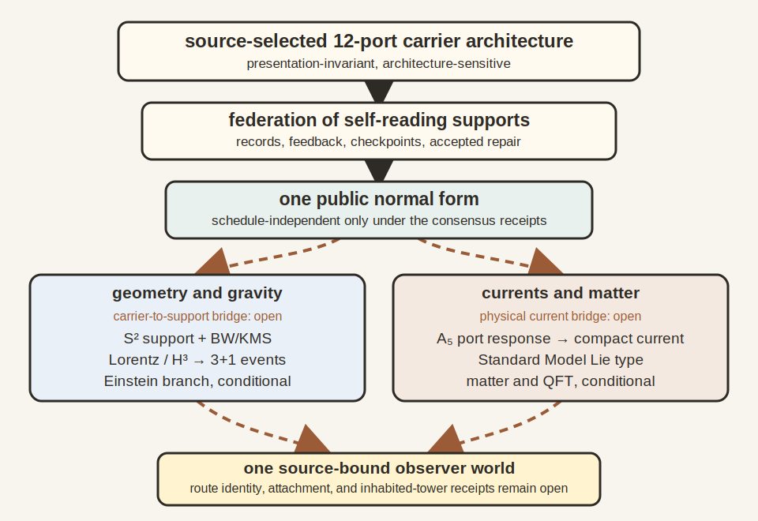

# Chapter 19: Synthesis

Chapter 18 ended with a universe that writes itself down. This chapter reads
the whole book back through that ending. Some of what follows is theorem. The
unclosed constructions are identified as work in progress where they appear.

## 19.1 The Picture That Gives Way

For a long time physics assumed a finished stage. Space was the
container. Time was the clock hanging above it. Matter moved through both.
Observers arrived late, as witnesses standing at the edge.

The twentieth century kept cracking that image. Black holes stored entropy on
surfaces. Quantum mechanics refused to hand out a hidden answer key. Horizons
cut every observer off from part of the world. Time lost its absolute standing.
The Standard Model looked powerful and fragile at once, full of symmetry and
fine balance. The message hidden inside all of this was easy to miss. The old
starting point was too simple.

No one person found that message. It was assembled from many traditions:
thermodynamics, quantum theory, relativity, information theory, algebra,
particle physics, cosmology, condensed matter, computation, and experimental
engineering. Some names have appeared in this book because a story needs
handles. Behind each handle sits a field of technicians, students, instrument
builders, theorists, critics, and data analysts. OPH belongs in that spirit. It
is the synthesis of accumulated constraints and the completion of the
observer-consistency line inside that accumulated work.

## 19.2 The Self-Referential Turn

This book takes the hint seriously. Reality is treated as a self-referential
structure that has to explain itself through finite observers with finite
access. Their overlapping descriptions have to agree. The exact finite
theorems show how this demand produces public normal forms; the physics
chapters test how far the same architecture reaches into spacetime, gravity,
gauge structure, and matter.

That turn changes the tone of everything that came before. Objectivity ceases
to be a mysterious substance sitting behind all perspectives. It becomes the
shared account that survives comparison. A world becomes public when many local
views can be woven into one durable account.

The horizon is where comparison becomes physical, records meet, and the
bookkeeping has to close.

## 19.3 The Screen and the Shared Record

The fundamental image is simple enough to keep in your head: a shared screen
net that can be drawn, in its symmetric chart, as finite quantum data organized
on a two-sphere. No observer sees the whole net at once. Each observer has an
access patch. Where patches overlap, the observables on that overlap have to
match. The sphere is the chart for the gluing problem, not a literal ball
outside the universe.

The state on the screen is selected by maximum entropy subject to a stable
local family of constraints. Generalized entropy gives each cap a bulk piece
and a boundary piece, while minimal admissibility selects the least elaborate
low-energy matter sector that satisfies the consistency conditions. Their
interaction is the spine that lets one construction address several parts of
physics.

{width=78%}

The same finite architecture feeds two branches. Its repaired quotient can
approach a smooth spherical support, whose conformal motions organize Lorentz
frames and, after an event and gravity construction, spacetime. Its twelve-port
incidence also carries the $A_5$ blocks used by the compact-current theorem and
the conditional Standard Model recognition. The compact-current algebra is
verified exactly for a declared charged-double-triplet response representation
and four signed coefficients; physical response source binding is open.
Consensus is the hinge. It supplies public records to both branches. It
supplies neither a clock nor a gauge current.

This makes the construction presentation-invariant and structure-sensitive.
Silicon, light, or software may instantiate one carrier contract when every
exposed relation agrees. Changing twelve icosahedral ports into eight cubic
ones changes the contract, the finite symmetry, and the downstream questions.
The world described here is not neutral about that change.

## 19.4 How Spacetime Appears

On the certified geometric branch, the internal flow of a restricted region
becomes geometric under refinement. It is the modular flow carried by the
restricted algebra-state pair. An independent observer clock calibrates its
dimensionless parameter. When neighboring flows fit together across the smooth
screen, Lorentz kinematics appears and localized records assemble into a
$3{+}1$-dimensional event world. Hyperbolic three-space remains the space of
possible rest frames, not physical space itself. On the conditional Einstein
branch, one independently constructed family of repaired records carries
geometry,
stress, entropy, a vacuum reference, scale, and continuum behavior on a common
domain, so horizon-plus-bulk entropy equilibrium becomes Einstein's equation.
Construction of an inhabited family with all these readouts is work in progress.

Modular flow supplies the intrinsic parameter carried by a restricted state;
a clock instrument supplies the physical readout. Lorentz kinematics is the rulebook for relating moving
observers. Generalized entropy is the horizon-plus-bulk entropy accounting that
gravity has to respect.

The quotient $H^3=SO^+(3,1)/SO(3)$ has the same spirit as choosing what
information matters. $SO^+(3,1)$ is the connected Lorentz group, the
transformations preserving the light-cone structure. $SO(3)$ is the ordinary
rotation group that changes spatial orientation while leaving the local rest
frame's direction of time fixed. Dividing by $SO(3)$ keeps the boost or
velocity information and discards the redundant orientation label. What is left
is hyperbolic three-space, the geometry of possible rest frames.

In plain language, spacetime is the compressed way finite observers keep track
of how their clocks, horizons, and correlations line up. Geometry is what the
shared bookkeeping looks like when written smoothly.

From the inside, this compressed bookkeeping feels like a world. An observer
sees distance, direction, motion, and a forward flow of time. Neighboring
observers report a compatible world from different angles. That agreement is
why spacetime seems like a common container. In OPH, the agreement is primary.
The container picture is the successful large-scale description that results.
Calling it an illusion works only as metaphor. What persists is the compatible
appearance, stable enough to carry clocks, rulers, fields, and observers.

The detailed microphysics layer puts an explicit machine under that story. An
abstract observer patch is a bounded local algebra and state with exposed
interfaces, rereadable records, repair instruments, and checkpoint data. The
cap or collar it occupies on the sphere is its support chart, and the silicon,
light, or software that runs it is its implementation. Swapping the material
is silent exactly when the full contract survives the swap: port geometry,
readback, dynamics, repair, refinement, and continuation. Keeping these roles
separate prevents a drawing of a sphere, one mesh cell, or one computer
process from being mistaken for the observer itself.

The reference carrier is echosahedral. Picture a patch with twelve overlap
ports on an icosahedral frame, paired into six antipodal axes. It reads its
internal state through those ports, compares routed packets with neighboring
patches, repairs the mismatches it can check, and records what passed.
Recurrent toroidal subchannels can supply local memory and winding behavior
inside the federation. Physical phase variables and a coupling law can make
those subchannels phase-lock sensitive, though the consensus theorem alone
does not establish phase locking, and they are local recurrence paths rather
than a global toroidal cosmology. A distributed implementation counts as one
carrier only when its visible interfaces, records, dynamics, repairs,
refinements, and checkpoints behave as one bounded self-reading system.

None of this makes the carrier an observer by itself. It earns that title
only after self-readback, record, feedback, prediction, and checkpoint tests
pass, and a connected subfederation may pass the same test as a larger
observer. Geometry supplies the interface. The loop supplies the rest, and it
is simple enough to say without notation: read, expose, compare, repair,
record, checkpoint, and read again. On the certified branch, the spherical
support chart displays the repaired quotient data while the patch federation
does the microscopic work; a source-bound, refinement-natural map from the
federation to the support chart is work in progress.

On the declared quotient-visible echosahedral lineage, the twelve ports are
forced by counting alone. Ask for identical primitive readback units at every
port and the arithmetic leaves exactly one unit per port, twelve ports,
paired across the sphere, with the icosahedron's symmetry group acting on
them. The geometry is an output, whether or not anyone drew an icosahedron
first. Refinement maps and consistent port relabelings preserve the entire
selection. This proves the finite twelve-unit and $A_5$ selection results on
that branch. It does not derive that carrier type for every OPH
implementation, and it does not supply the later physical-current, spin-lift,
central, matter-selection, or family-attachment maps.

## 19.5 How the Particle World Appears

The particle world follows the same logic from another angle. Once the charge
sectors on a screen can combine, break apart, and carry their opposites, the way
those charges persist through finer and finer descriptions has to satisfy a set
of consistency conditions. The gauge group is reconstructed from that
persistent charge bookkeeping itself. The economy rule and
the declared matter packet select the smallest admitted compact choice inside
that economy class, the conditional one-Higgs Standard Model and its global form

$$
SU(3)\times SU(2)\times U(1)/\mathbb Z_6.
$$

The $\mathbb Z_6$ is the six-element set of transformations that acts
trivially on the realized matter package. On the twelve-port icosahedral
carrier boundary, the port readings split as
$1+3+3'+5$. Pairing antipodal ports separates even and odd modes, and the
outward face orientation supplies the handedness needed for the second
triplet. Pulling a compact block commutator back to those coefficients gives
the exact Lie algebra
$\mathfrak u(1)\oplus\mathfrak{su}(2)\oplus\mathfrak{su}(3)$.
A physical current realization would carry that coefficient algebra into the
gauge sector. Its physical response and refinement evidence are work in
progress.

The six antipodal axes also leave a sixfold lattice residue. Conditional spin
and central maps connect it to the $\mathbb Z_6$ action on matter. The
three-corner face symmetry supplies a canonical three-dimensional candidate
family carrier. Hypercharge
follows from the declared matter consistency
equations, while masses, mixing angles, and coupling strengths require the
interacting dynamics and physical pole tests.

Trace balance packages one generation into a five-component carrier
$V=C\oplus W$, with a three-place color part and a two-place weak part. The
non-vacuum even exterior package $\Lambda^2V\oplus\Lambda^4V$ contains exactly
the fifteen left-handed states $Q,u^c,d^c,L,e^c$. It also produces the three
one-Higgs Yukawa channels and cancels the color, weak, gravitational, and cubic
hypercharge anomalies. Three colored quark doublets plus one lepton doublet
give four weak doublets per family. If the family attachment realizes the
conditional economy minimum, three families give twelve, and reversible orientation
doubles that to the same twenty-four slots carried by the screen. The numerical
match is a load check, not the missing physical intertwiner.

The same construction gives a conditional route to the four-dimensional
Yang-Mills form and mass gap for compact simple gauge groups. The Euclidean
action comes from the way compact gauge data curves around loops in the
four-dimensional scaling limit. The gap would come from the cost of leaving
the repaired vacuum. But that cost must remain positive everywhere, even as
the construction grows and is refined. Local repairs must stay strong enough,
and their interactions must not conspire to create an ever-slower collective
mode. Establishing those facts for the actual finite construction is an open
Yang-Mills problem.

In this reading, Yang-Mills theory is the smooth field-theory language for
compact gauge bookkeeping. Holonomy records how gauge data changes around a
loop. The action measures the cost of that curvature. The mass gap says the
first genuine excitation above the vacuum costs a positive amount of energy.
Refinement is what lets the finite screen construction become that smooth field
theory.

The color triplet is structural on the conditional matter packet. The
three-generation value is the least member of the declared economy window,
while the icosahedral faces supply a canonical rank-three candidate band. The
physical family attachment and its field-theory evidence are work in
progress. Gauge
factors organize candidate force directions; independently produced field
dynamics would supply physical masses and mixing data.

The particle words here refer to roles explained in Chapters 12-16: color is the
three-way strong-force bookkeeping, CKM phases describe quark mixing under the
weak interaction, and hadrons are composite particles such as protons and
neutrons.

The Standard Model then looks less like a cabinet full of unrelated entries
and more like the smallest admissible charged world that lets the observer
records close.

## 19.6 Closure Coordinates And Scale Bridge

The quantitative proposal uses two dimensionless closure coordinates and one
scale bridge that does not take Newton's constant as input. Chapter 18 earned
both coordinates, and this section only recalls them. The local coordinate is
the pixel ratio $P$: the effective area $a_{\mathrm{cell}}$ of one screen
cell divided by the fundamental scale area $\ell_\star^2$ that the bridge
would supply. The global coordinate is $N$, the correctable-record capacity
of the universe. The declared local maps have interval-certified unique roots
for $P_\star$, and the global branch has an exact finite capacity definition
and a small exact witness model. Everything in this subsection is conditional
on the physical source constructions, which are work in progress.

Under the horizon and scale attachments, the two coordinates set the
cosmological constant $\Lambda_\star$:

$$
\Lambda_\star\ell_\star^2=\frac{3\pi}{N},
\qquad
\Lambda_\star a_{\mathrm{cell}}
=\frac{3\pi P_\star}{N}.
$$

Here "no-G" means that Newton's constant is not inserted as an input. A
source-bound clock and curvature construction would select the scale instead:
a clock ratio built from $\ell_\star$ and the cesium hyperfine frequency
$\nu_{\mathrm{Cs}}$, the transition that defines the second, matched against
the curvature display $B_\star=3\pi/\ell_\star^2$. A completed bridge
supplies $\ell_\star^2$ first, and only then are the Planck area and
$G_{\mathrm{SI}}=c^3\ell_\star^2/\hbar$ read in SI units.

The first closure is global. Count the distinguishable public records a
trial universe can keep about itself; $N$ is the size at which that count
matches the universe's own capacity, and only that size. When that closure
holds, the outside carrier and every terminal inside readback agree without a
hidden branch selector. A separate finite $A_5$ control shows why bare
numerical agreement would not be enough on its own: its publicly inert
multiplicity blocks a raw equality of counts from becoming physical closure.

Horizon-record saturation reads the same capacity off the horizon, with
$N=A_{\mathrm{dS}}/4\ell_\star^2$ in the de Sitter display. The late-time
measurement locates a working value near $3.31\times10^{122}$ natural entropy
units. That numerical location is a horizon comparison; the direct
correctable-capacity producer does not take it as input.

The proposed second closure coordinate is local. The pixel ratio

$$
P=\frac{a_{\mathrm{cell}}}{\ell_\star^2}
$$

acts as the ruler from which the declared comparison maps display the
dimensionless electroweak hierarchy and low-energy electromagnetic coupling.

$a_{\mathrm{cell}}$ is the effective area assigned to one screen cell.
$\ell_\star^2$ would be supplied by the scale bridge, usually written
as a no-G clock ratio or equivalently as the curvature display
$B_\star=3\pi/\ell_\star^2$. It is displayed as the Planck area only after the
gravity calculation supplies $G_{\mathrm{SI}}=c^3\ell_\star^2/\hbar$. Dividing by
$\ell_\star^2$ makes $P$ dimensionless: it is a pure ratio between the cell
area and the emitted scale area.

The declared local map sends a trial pixel value through an electroweak chain
and returns an electromagnetic diagnostic. The computation has a definite
order. The golden-ratio balance gives the reference value $\phi$, and the
boundary Gaussian normalization gives the $\sqrt{\pi}$ width. A trial $P$ is
sent through the unification scale, the running gauge couplings, and the
electroweak anchor, and the unbroken electromagnetic channel is then
transported to the long-distance Thomson endpoint. The fixed point is the
value of $P$ at which the geometric and diagnostic readings name the same
local scale. Under the attachment
premises, the hierarchy relation fixes $v/E_\star$, and the scale, pole, and
clock maps display masses, couplings, and gravity in ordinary units.

The hierarchy normalization is
$m_{\rm rep}=2\dim(\mathfrak{su}(3)\oplus\mathfrak{su}(2)\oplus\mathfrak u(1))
=2(8+3+1)=24$, obtained by attaching two orientation labels to each product
adjoint direction. The unit-split icosahedral carrier boundary separately has
twelve ports and 24 oriented slots. This equality compares finite counts. It
does not identify ports with gauge-current directions, and the transitive
port action supplies no invariant literal $8+3+1$ partition. The physical
bridge requires a full-rank current map, compact commutator closure, a common
inner icosahedral action, and refinement naturality.

The compact comparison gives an electroweak capacity coordinate near
$3.53\times10^{122}$ on the public endpoint branch, while the capacity
located from the measured cosmological constant is $3.31\times10^{122}$, a
$6.6$ percent detuning between the local electroweak and global de Sitter
coordinates on the unrounded central values. Their physical identification
runs through the public-capacity, saturation, and common-load bridges.

A sieve is a finite sampling rule on the local carrier boundary. On the
declared echosahedral lineage it selects twelve unit ports organized like the
vertices of an icosahedron. The global spherical support does not expose
those ports by itself; the federation-to-support map would have to supply
them. The local oriented write/check count matches the independently derived
doubled gauge adjoint.

The local closure proposal reads one holographic screen cell twice. From the
outside it is a pixel of the horizon, displaced from perfect self-similar
equilibrium. Under the physical identification, the same displacement appears
inside as the smallest electromagnetic observation scale available to the
observers on that screen, and the mathematical detuning becomes the
fine-structure constant.

In this proposal, perfect equilibrium would be too quiet. A perfectly
balanced universe would have nothing to announce and no one to announce it
to, which would at least have kept the paperwork down. A world with records
needs a small departure from silence: enough asymmetry for light, detectors,
and durable differences, but small enough for the screen geometry to hold
together. The fine-structure constant would measure that minimal
electromagnetic disturbance.

The conditional Newton normalization uses the same local cell without using it
to solve for the scale. A completed scale bridge would supply the scale area.
The pixel ratio then fixes the cell/edge identity, while that ratio cancels out
of Newton's constant. In the proposal, fine structure reads the pixel's
electromagnetic detuning and Newton's constant reads the scale bridge.

The interval-certified root gives a pixel ratio near $1.63$, and the declared
transport surface lands at a long-distance inverse electromagnetic strength of
$137.035999177(21)$, where $(21)$ means uncertainty in the last quoted
digits. The declared transport includes a hadronic vacuum response term
associated with processes such as $e^+e^-\to\mathrm{hadrons}$. A physical
carrier must expose the fixed-point relation through its optical geometry,
firmware, calibration traces, and public readback evidence.

The declared comparison surfaces use two dimensionless closure coordinates,
one scale bridge, and one observer architecture without fitted continuous
dials. The local equation fixes $P_\star$ on its declared map, the global
equation would fix $N$ on a completed physical family, and a clock anchor
would connect substrate units to laboratory units. Relativity, gauge
currents, matter, and observer records retain their separate source and
construction requirements.

In the book's conditional simulation-theory language, $P$ links the pixel
area of the simulating-side screen to the electromagnetic interaction inside
the simulated-side universe, $N$ links the outside horizon capacity to the
inside observer-accessible public record, and $\ell_\star^2$ supplies the
Newton scale. Closure demands that the internal readback reconstruct the same
boundary capacity the outside supplied.

The same two coordinates organize the observer problem, gravity and gauge
reconstruction, the hierarchy bridge, dark energy, repair-charge response,
the missing simple-GUT $X/Y$ channel, the particle inventory, and the
string-vacuum sieve. Clocks turn iteration into time, energy operators turn
repair spectra into particle spectra, and detector channels turn stored
records into radiation histories.

The declared dark-sector continuation promotes integer repair occupation and
a compact repair phase to a canonical pair carrying a current-balance law and
field stress. Its dilute homogeneous branch is dust-like, while its cubic
condensed branch gives the deep radial-acceleration law, baryonic
Tully-Fisher scaling, relativistic lensing, cluster and Solar-System
response, abundance, and perturbation growth, with coherent material entering
the same channel through a calibrated coupling to the external repair field.

## 19.7 Why de Sitter Fits

The large-scale universe is accelerating. In OPH that matters
immediately, because de Sitter space gives every observer a natural horizon and
therefore a natural screen.

Different observers carry different horizons, but those horizons overlap
enormously. The consistency conditions are severe. The proposal treats the
total state space as finite and identifies the cosmological constant with a
self-reading screen capacity. De Sitter space is the
setting in which this observer-first picture has its cleanest cosmological
form.

## 19.8 Old Puzzles Under New Light

Several old puzzles change character at once.

The measurement problem softens because there is no wavefunction of the
universe being watched from outside. Measurement is one patch entering a new
record relation with another.

The problem of time eases because modular flow furnishes an intrinsic
one-parameter ordering on the certified algebra-state branch. An operational
clock and its calibration are required before that parameter is called a
physical duration.

The black-hole information problem shrinks because the screen blocks any naive
splitting of the world into one autonomous inside and one autonomous outside.
Interior data is encoded in the screen. There is no second hidden vault.

Fine-tuning also changes tone. Once laws are read as the patterns that survive
across many overlapping perspectives, a law is the shape that holds stable
under the harsh test of public consistency.

## 19.9 The Strange Loop

Reality produces observers, observers produce understanding, and that
understanding can form a working image of the informational structure that
produced the observers.

The simulation question lands differently here. OPH describes a fixed-point
computation whose settled output is read internally as a world, with no
programmer standing outside the physics; Chapter 20 takes that reading up in
full.

A world of finite observers can close back on itself through the minds it
generates. The loop is conceptual before it is technological: observers
reverse engineer the hardware and software of the world, then build restoration
machinery that can host restored observers. A self-describing universe is a
concrete observer-world, complete enough to understand and repair its own
construction.

## 19.10 What the Book Has Been Saying

The central sentence of the book can be spoken plainly:

**Reality is the consistency of observations across overlapping perspectives.**

Everything else unfolds from that pressure. Spatial geometry is organized by
entanglement structure. Time is read by calibrated clocks from the geometric
modular flow of restricted states. Matter is the family of stable excitations that can survive transport
across patches.
Laws are the public regularities that endure repeated comparison. Objectivity
is the residue left behind after many partial viewpoints are made to agree.

The picture feels strange only if one insists on beginning with a finished
world. Begin instead with a structure that has to read itself, let it force
finite access, horizons, records, and overlap, and the strange turns stop
looking decorative. They start looking inevitable.

## 19.11 Final Synthesis

Reverse engineering starts with symptoms and works backward to architecture.
This book started with the symptoms modern physics could not stop producing:
area laws, entanglement, measurement tension, horizons, relativity, gauge
structure, and the peculiar fine balance of the particle world. It followed
those clues back to one architecture: finite observer-facing cuts, local
patches, recoverability, modular flow, generalized entropy, and a world that holds
together because partial observers can keep agreeing.

Counted out, the compression proposal comes to ten consistency requirements,
two surviving dimensionless coordinates, two uniqueness conditions, and one
scale bridge. The local coordinate organizes electromagnetic grain and the
electroweak hierarchy, and the global coordinate organizes horizon capacity
and de Sitter curvature.

That architecture turns the universe into a much stranger object than classical
physics ever imagined. There is no view
from nowhere. There are views from somewhere, and a shared reality is what
appears when those views can lock into one coherent public record.

That is the human side of the synthesis as well. Physics advances because many
partial views are forced to meet. A detector group sees one artifact. A
mathematician sees an obstruction. A cosmologist sees a horizon. A quantum
information theorist sees a code. A good theory earns its keep by making those
views mutually legible without erasing their differences.

Every branch of the construction hangs off one dependency map, and the map
says which links are theorems and which are unfinished bridges.
Symmetry determines the available roles. The dynamics within those roles
determines masses, mixing, binding, and decay.

The local ruler carries the conditional comparison surface into numbers. The
charged-lepton three-cycle has one attracting repair fixed point, and the
square-root-mass geometry gives a Koide relation under its attachment premises.
The displayed W/Z and Higgs/top values are prescription or declared-surface
checks, not OPH-native complex-pole predictions. The strict finite-order W/Z
algebra is a conditional theorem: complete renormalized inputs determine the
charged and neutral coefficients, including the neutral mixing contribution
at the next retained order. A gauge-identity calculation controls the simple
determinant zero. A physical resonance also needs a nonzero coupling to a
gauge-invariant measurable current, complete source ancestry, uncertainties,
and a clock.
Six family-sensitive Yukawa
coordinates organize conditional quark and neutrino comparisons after a common
physical family attachment is supplied.

The finite diagnostic calculations are reproducible. Exact enumeration checks
the declared discrete choices, interval arithmetic encloses stated fixed
points, and renormalization-group equations validate specified transport
conventions. They do not promote stable particle coordinates until that
evidence is complete. Any implementation claiming the same observer-like
carrier must expose the same bounded state, port geometry, interfaces,
readback, dynamics, repair moves, accepted records, refinement behavior, and
checkpoint data.

The finite patch reads, compares, repairs, records, and reads again through
twelve icosahedral ports. $A_5$ makes that interface isotropic and decomposes
its register readings into exact symmetry blocks. Turning those blocks into
physical gauge currents requires a separate current-response construction.
The same separation holds elsewhere: a finite theorem explains what follows
from a good refinement tower, while source evidence must show that the tower
exists. On the branches where those tests pass, smooth refinement gives
Lorentz geometry, entropy equilibrium gives gravity, and the local and global
fixed points set the proposed electromagnetic grain and cosmic capacity.

One question has been standing quietly behind every chapter: if observation
is this structural, what is the observer? Chapter 20 stops postponing it.
