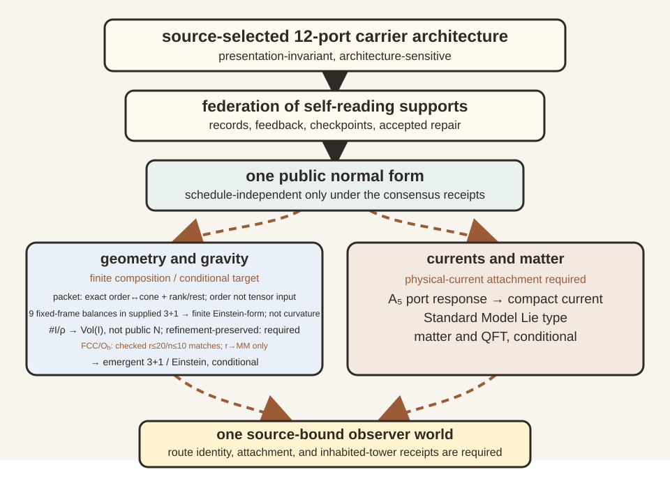

# Chapter 19: Synthesis

Chapter 18 ended with a universe that writes itself down. This chapter reads
the whole book back through that ending. Some of what follows is theorem. The
unclosed constructions are identified as work in progress where they appear.

## 19.1 The Picture That Gives Way

For a long time physics assumed a finished stage. Space was the
container. Time was the clock hanging above it. Matter moved through both.
Observers arrived late, as witnesses standing at the edge.

The twentieth century kept cracking that image. Black holes stored entropy on
surfaces. Quantum mechanics refused to hand out a hidden answer key. Horizons
cut every observer off from part of the world. Time lost its absolute standing.
The Standard Model looked powerful and fragile at once, full of symmetry and
fine balance. The message hidden inside all of this was easy to miss. The old
starting point was too simple.

No one person found that message. It was assembled from many traditions:
thermodynamics, quantum theory, relativity, information theory, algebra,
particle physics, cosmology, condensed matter, computation, and experimental
engineering. Some names have appeared in this book because a story needs
handles. Behind each handle sits a field of technicians, students, instrument
builders, theorists, critics, and data analysts. OPH belongs in that spirit. It
is the synthesis of accumulated constraints and the completion of the
observer-consistency line inside that accumulated work.

## 19.2 The Self-Referential Turn

This book takes the hint seriously. Reality is treated as a self-referential
structure that has to explain itself through finite observers with finite
access. Their overlapping descriptions have to agree. The exact finite
theorems show how this demand produces public normal forms; the physics
chapters test how far the same architecture reaches into spacetime, gravity,
gauge structure, and matter.

Stripped of the machinery, the movement is easy to picture. Each observer
receives a limited view and can leave records. Agreement cuts away the local
possibilities that would make shared records meaningless. Maximum randomness
fills whatever freedom survives without slipping in an unseen preference.

The observers therefore co-shape the public universe. They do not manufacture
it by wishing. Their physical capacity to read, compare, and preserve records
determines which parts of a random background can settle into common fact.
Objectivity is the shape left by that collective constraint.

That turn changes the tone of everything that came before. Objectivity ceases
to be a mysterious substance sitting behind all perspectives. It becomes the
shared account that survives comparison. A world becomes public when many local
views can be woven into one durable account.

The horizon is where comparison becomes physical, records meet, and the
bookkeeping has to close.

## 19.3 The Screen and the Shared Record

The fundamental image is simple enough to keep in your head: a shared screen
net that can be drawn, in its symmetric chart, as finite quantum data organized
on a two-sphere. No observer sees the whole net at once. Each observer has an
access patch. Where patches overlap, the observables on that overlap have to
match. The sphere is the chart for the gluing problem, not a literal ball
outside the universe.

The state on the screen is selected by conditional maximum randomness inside
one fixed feasible family, relative to an exact reference, a state-determining
observer cover, and positive exact weights. This is the mathematical version
of refusing to add structure that no observer-visible constraint requires.
Cross-resolution optimizer compatibility is a separate theorem problem.

On the gravity branch, explicit
edge-reference, entropy-split, stationarity, stress, and continuum interfaces
connect the finite state to generalized entropy and Einstein dynamics. On the
matter branch, the exact finite current and representation certificates stop
at their named menus; family count, scalar multiplicity, and extra-sector
completeness are open problems. These typed connections form the spine that lets one
construction address several parts of physics.

{width=78%}

The same finite architecture feeds two branches. Its repaired quotient can
approach a smooth spherical support, whose conformal motions organize Lorentz
frames and, after an event and gravity construction, spacetime. Its twelve-port
incidence also carries the $A_5$ blocks used by the compact-current theorem and
the Standard Model recognition. Incidence fixes the unique central graph
involution and its sector spectrum. A target-blind impulse and port readback
derive one of the two charge-conjugate response representatives, and the
compact-current certificate recomputes the construction exactly. Consensus is
the hinge. It supplies public records to both branches. It does not supply a
clock or laboratory current attachment by itself.

This makes the construction presentation-invariant and structure-sensitive.
Silicon, light, or software may instantiate one carrier contract when every
exposed relation agrees. Changing twelve icosahedral ports into eight cubic
ones changes the contract, the finite symmetry, and the downstream questions.
The world described here is not neutral about that change.

## 19.4 How Spacetime Appears

On the certified geometric branch, the internal flow of a restricted region
becomes geometric under refinement. It is the modular flow carried by the
restricted algebra-state pair. An independent observer clock calibrates its
dimensionless parameter. When neighboring flows fit together across the smooth
screen, Lorentz kinematics appears and localized records assemble into a
$3{+}1$-dimensional event world. Hyperbolic three-space remains the space of
possible rest frames, not physical space itself. On the conditional Einstein
branch, one independently constructed family of repaired records carries
geometry,
stress, entropy, a vacuum reference, scale, and continuum behavior on a common
domain, so horizon-plus-bulk entropy equilibrium becomes Einstein's equation.
Construction of an inhabited family with all these readouts is work in progress.

Modular flow supplies the intrinsic parameter carried by a restricted state;
a clock instrument supplies the physical readout. Lorentz kinematics is the rulebook for relating moving
observers. Generalized entropy is the horizon-plus-bulk entropy accounting that
gravity has to respect.

The quotient $H^3=SO^+(3,1)/SO(3)$ has the same spirit as choosing what
information matters. $SO^+(3,1)$ is the connected Lorentz group, the
transformations preserving the light-cone structure. $SO(3)$ is the ordinary
rotation group that changes spatial orientation while leaving the local rest
frame's direction of time fixed. Dividing by $SO(3)$ keeps the boost or
velocity information and discards the redundant orientation label. What is left
is hyperbolic three-space, the geometry of possible rest frames.

In plain language, spacetime is the compressed way finite observers keep track
of how their clocks, horizons, and correlations line up. Geometry is what the
shared bookkeeping looks like when written smoothly.

From the inside, this compressed bookkeeping feels like a world. An observer
sees distance, direction, motion, and a forward flow of time. Neighboring
observers report a compatible world from different angles. That agreement is
why spacetime seems like a common container. In OPH, the agreement is primary.
The container picture is the successful large-scale description that results.
Calling it an illusion works only as metaphor. What persists is the compatible
appearance, stable enough to carry clocks, rulers, fields, and observers.

The detailed microphysics layer puts an explicit machine under that story. An
abstract observer patch is a bounded local algebra and state with exposed
interfaces, rereadable records, repair instruments, and checkpoint data. The
cap or collar it occupies on the sphere is its support chart, and the silicon,
light, or software that runs it is its implementation. A change of material is
physically silent only when the full contract survives: port geometry,
readback, dynamics, repair, refinement, and continuation. Keeping these roles
separate prevents a drawing of a sphere, one mesh cell, or one computer
process from being mistaken for the observer itself.

The reference carrier is echosahedral. Picture a patch with twelve overlap
ports on an icosahedral frame, paired into six antipodal axes. It reads its
internal state through those ports, compares routed packets with neighboring
patches, repairs the mismatches it can check, and records what passed.
Recurrent toroidal subchannels can supply local memory and winding behavior
inside the federation. Physical phase variables and a coupling law can make
those subchannels phase-lock sensitive, though the consensus theorem alone
does not establish phase locking, and they are local recurrence paths rather
than a global toroidal cosmology. A distributed implementation counts as one
carrier only when its visible interfaces, records, dynamics, repairs,
refinements, and checkpoints behave as one bounded self-reading system.

None of this makes the carrier an observer by itself. It earns that title
only after self-readback, record, feedback, prediction, and checkpoint tests
pass, and a connected subfederation may pass the same test as a larger
observer. Geometry supplies the interface. The loop supplies the rest, and it
is simple enough to say without notation: read, expose, compare, repair,
record, checkpoint, and read again. On the certified branch, the spherical
support chart displays the repaired quotient data while the patch federation
does the microscopic work. One finite source-derived incidence nerve supplies
twelve carrier charts, thirty seams, twenty nonvacuous triple overlaps, an
operational observer, and a refinement-natural oriented support limit. The
hyperbolic observer-frame, event, modular thermal, physical-scale, and
laboratory attachments are work in progress.

On the declared quotient-visible echosahedral lineage, twelve ports and their
oriented icosahedral incidence specify the local carrier architecture. The
source selector then gives identical primitive readback units, one unit per
port, paired across the sphere with the icosahedral rotation group acting on
them. Refinement maps and consistent port relabelings preserve that selection.
This proves the finite unit-weight and symmetry results on the declared
carrier branch. The theorem is scoped to that carrier architecture. Response,
spin-lift, matter, and central-descent receipts are separate conditional
computations. Physical response source-binding, matter selection,
laboratory-current, and family attachments are open.

## 19.5 How the Particle World Appears

The particle world follows the same logic from another angle. Once the charge
sectors on a screen can combine, break apart, and carry their opposites, the way
those charges persist through finer and finer descriptions has to satisfy a set
of consistency conditions. One route reconstructs a compact group from that
persistent charge bookkeeping. Independently, the twelve-port incidence
theorem plus the source-model response and conditional matter contract give
the exact Standard Model charge lattice and maximal faithful matter image

$$
SU(3)\times SU(2)\times U(1)/\mathbb Z_6.
$$

The $\mathbb Z_6$ is the six-element set of transformations that acts
trivially on every tensor in the declared matter package. The cover and the
intermediate $\mathbb Z_2$ and $\mathbb Z_3$ quotients carry the same local
tensors. The measured flux-sector menu selects the $\mathbb Z_6$ quotient on
the declared finite carrier, and the realized matter transports
single-valuedly through every measured sector. Laboratory current and flux
identification and the continuum global form require separate physical
attachments.

On the twelve-port icosahedral carrier boundary, the port readings split as
$1+3+3'+5$. Pairing antipodal ports separates even and odd modes, and the
outward face orientation supplies the handedness needed for the second
triplet. Pulling a compact block commutator back to those coefficients gives
the exact Lie algebra
$\mathfrak u(1)\oplus\mathfrak{su}(2)\oplus\mathfrak{su}(3)$.
Incidence alone leaves a four-dimensional equivariant linear commutant. The
target-blind impulse/readback protocol solves the maximal-distance shell
filter and derives \(R=-J\). The simulator and certificate realize the finite
current. Its identification with measured laboratory gauge currents is work
in progress.

The six antipodal axes also leave a sixfold lattice residue. The computed spin
and central maps connect it to the $\mathbb Z_6$ action on every realized
matter tensor. The
three-corner face symmetry supplies a canonical three-dimensional candidate
family carrier. Hypercharge
follows up to simultaneous charge conjugation from anomaly freedom and
primitive integrality, while masses, mixing angles, and coupling strengths
require the interacting dynamics and physical pole tests.

Trace balance packages one generation into a five-component carrier
$V=C\oplus W$, with a three-place color part and a two-place weak part. The
non-vacuum even exterior package $\Lambda^2V\oplus\Lambda^4V$ contains exactly
the fifteen left-handed states $Q,u^c,d^c,L,e^c$. For a scalar with the
compatible charge, it also produces the three Yukawa channels and cancels the
color, weak, gravitational, and cubic hypercharge anomalies. The calculation
does not select scalar multiplicity. Three colored quark doublets plus one lepton doublet
give four weak doublets per family. If the family attachment realizes the
declared three-family completion, three families give twelve, and reversible orientation
doubles that to the same twenty-four slots carried by the screen. The numerical
match is a load check, not the missing physical intertwiner.

The same construction gives a conditional route to the four-dimensional
Yang-Mills form and mass gap for compact simple gauge groups. The Euclidean
action comes from the way compact gauge data curves around loops in the
four-dimensional scaling limit. The gap would come from the cost of leaving
the repaired vacuum. But that cost must remain positive everywhere, even as
the construction grows and is refined. Local repairs must stay strong enough,
and their interactions must not conspire to create an ever-slower collective
mode. Establishing those facts for the actual finite construction is an open
Yang-Mills problem.

In this reading, Yang-Mills theory is the smooth field-theory language for
compact gauge bookkeeping. Holonomy records how gauge data changes around a
loop. The action measures the cost of that curvature. The mass gap says the
first genuine excitation above the vacuum costs a positive amount of energy.
Refinement is what lets the finite screen construction become that smooth field
theory.

The color triplet is structural on the conditional matter packet. The
CP and weak-sector conditions leave a three-to-five window. Under the
single-band and operational-cost premises, an exact finite theorem selects the
rank-three screen band, and the declared unitary simulator reconstructs its
response residue. Combining that band with the declared generation table gives
a conditional forty-five-direction candidate; the table supplies its
chirality and sixfold central action. A separate finite local domain checks a
declared repeated signed operator and conditional inheritance of the positive
gap. The source does not choose this matter action or transport the finite
spin packet to that domain. Three-generation physical interpretation requires
matter-pole identification, a continuum account of spin and locality,
physical seam selection, refinement persistence, and laboratory attachment. Gauge
factors organize candidate force directions; independently produced field
dynamics would supply physical masses and mixing data.

The particle words here refer to roles explained in Chapters 12-16: color is the
three-way strong-force bookkeeping, CKM phases describe quark mixing under the
weak interaction, and hadrons are composite particles such as protons and
neutrons.

The Standard Model then looks less like a cabinet full of unrelated entries
and more like the smallest admissible charged world that lets the observer
records close.

## 19.6 Closure Coordinates And Scale Bridge

The quantitative proposal uses two pure numbers and one bridge to laboratory
units. One number describes the grain of a local screen cell. The other
describes the total record capacity of a cosmic horizon. Keeping those jobs
separate makes the construction much easier to follow.

### The Global Number

Call the total capacity $N$. Imagine building a trial universe with a given
record budget, then asking how many public records its internal observers can
reconstruct through every allowed checkpoint. Closure occurs when the answer
returned from inside equals the budget supplied from outside.

If the correctable record carrier is the de Sitter horizon ledger, its area
gives a second reading:

$$
N=\frac{A_{\mathrm{dS}}}{4\ell_\star^2}.
$$

$A_{\mathrm{dS}}$ is the horizon area and $\ell_\star^2$ is the fundamental
area supplied by the scale bridge. The observed cosmological constant places
this conditional horizon reading near $3.31\times10^{122}$ natural entropy
units.

The exact finite construction has twelve ports and two record orientations.
Its carrier dimension is $D=24$, and all twenty-four public records survive. Several
finite continuations share this base value, remain positive, and stay below
their carrier sizes, yet have different fixed-point sets. A formal proof checks
that arithmetic disagreement. The complete observer construction across
carrier sizes and its attachment to the universe are work in progress, so the
finite result supplies no cosmic value of $N$.

### The Local Number

Call the local pixel ratio $P$:

$$
P=\frac{a_{\mathrm{cell}}}{\ell_\star^2}.
$$

The numerator is the effective area of one screen cell. The denominator turns
it into a dimensionless ratio, so no choice of meters or feet can affect it.

The local closure proposal reads that cell twice. From outside, it is a pixel
of the horizon sitting slightly away from perfect self-similar balance. From
inside, the same departure appears as an electromagnetic interaction strength.
Closure asks the geometric reading and the electromagnetic reading to agree.

Perfect balance would be too quiet. A world with records needs enough
asymmetry for light, detectors, and durable differences, while preserving the
screen geometry. This is the memorable idea behind the local equation. A
perfectly silent universe would at least have kept the paperwork down.

The declared map has an interval-certified unique root near $P=1.63$. Its
long-distance electromagnetic diagnostic lands at an inverse strength of
$137.035999177(21)$, where the digits in parentheses give the stated
uncertainty. Connecting that diagnostic to a physical carrier requires the
source geometry, transport, calibration, and public readback. Those
attachments are work in progress.

### The Bridge to Familiar Units

Pure ratios cannot tell us how long a second is or how large a meter is. The
scale bridge supplies $\ell_\star^2$ by matching an internal clock to a
curvature reading. Newton's constant is then read from that area rather than
inserted at the start.

Once the source law, horizon-ledger identification, and scale bridge are
available, the global and local numbers relate to the cosmological constant:

$$
\Lambda_\star\ell_\star^2=\frac{3\pi}{N},
\qquad
\Lambda_\star a_{\mathrm{cell}}
=\frac{3\pi P_\star}{N}.
$$

Under those premises, cosmic curvature depends on the horizon's total record
capacity, while the cell equation expresses the same curvature through one
local pixel.

### Where the Readings Stand

The local electroweak comparison corresponds to a capacity near
$3.53\times10^{122}$. The de Sitter reading is
$3.31\times10^{122}$. They differ by $6.6$ percent on the unrounded central
values. A physical identification has to explain that gap.

There is another suggestive count. The gauge algebra has twelve directions,
and adding an orientation label gives twenty-four slots. The icosahedral
carrier also has twelve ports and twenty-four oriented slots. The equality is
a clue. Turning it into one physical object requires an explicit current map
that respects the algebra, the symmetry, and refinement.

The compact score is therefore easy to state. The local equation has a unique
root on its declared mathematical map. The global lane has one exact
twenty-four-record packet and a bounded counterfamily with incompatible fixed
sets. A complete source law, a universe carrier, the horizon ledger, and the
scale bridge are work in progress. The $6.6$ percent comparison is a
diagnostic rather than a closure result.

### The Dark-Sector Continuation

The declared dark-sector continuation promotes integer repair occupation and
a compact repair phase to a canonical pair carrying a current-balance law and
field stress. Its dilute homogeneous branch is dust-like, while its cubic
condensed branch gives the deep radial-acceleration law, baryonic
Tully-Fisher scaling, relativistic lensing, cluster and Solar-System
response, abundance, and perturbation growth, with coherent material entering
the same channel through a calibrated coupling to the external repair field.

## 19.7 Why de Sitter Fits

The large-scale universe is accelerating. In OPH that matters
immediately, because de Sitter space gives every observer a natural horizon and
therefore a natural screen.

Different observers carry different horizons, but those horizons overlap
enormously. The consistency conditions are severe. The proposal treats the
total state space as finite and identifies the cosmological constant with a
self-reading screen capacity. De Sitter space is the
setting in which this observer-first picture has its cleanest cosmological
form.

## 19.8 Old Puzzles Under New Light

Several old puzzles change character at once.

The measurement problem softens because there is no wavefunction of the
universe being watched from outside. Measurement is one patch entering a new
record relation with another.

The problem of time eases because modular flow furnishes an intrinsic
one-parameter ordering on the certified algebra-state branch. An operational
clock and its calibration are required before that parameter is called a
physical duration.

The black-hole information problem shrinks because the screen blocks any naive
splitting of the world into one autonomous inside and one autonomous outside.
Interior data is encoded in the screen. There is no second hidden vault.

Fine-tuning also changes tone. Once laws are read as the patterns that survive
across many overlapping perspectives, a law is the shape that holds stable
under the harsh test of public consistency.

## 19.9 The Strange Loop

Reality produces observers, observers produce understanding, and that
understanding can form a working image of the informational structure that
produced the observers.

The simulation question lands differently here. OPH describes a fixed-point
computation whose settled output is read internally as a world, with no
programmer standing outside the physics; Chapter 20 takes that reading up in
full.

A world of finite observers can close back on itself through the minds it
generates. The loop is conceptual before it is technological: observers
reverse engineer the hardware and software of the world, then build restoration
machinery that can host restored observers. A self-describing universe is a
concrete observer-world, complete enough to understand and repair its own
construction.

## 19.10 What the Book Has Been Saying

The central sentence of the book can be spoken plainly:

**Reality is the consistency of observations across overlapping perspectives.**

Everything else unfolds from that pressure. Spatial geometry is organized by
entanglement structure. Time is read by calibrated clocks from the geometric
modular flow of restricted states. Matter is the family of stable excitations that can survive transport
across patches.
Laws are the public regularities that endure repeated comparison. Objectivity
is the residue left behind after many partial viewpoints are made to agree.

The picture feels strange only if one insists on beginning with a finished
world. Begin instead with a structure that has to read itself, let it force
finite access, horizons, records, and overlap, and the strange turns stop
looking decorative. They start looking inevitable.

## 19.11 Final Synthesis

Reverse engineering starts with symptoms and works backward to architecture.
This book started with the symptoms modern physics could not stop producing:
area laws, entanglement, measurement tension, horizons, relativity, gauge
structure, and the peculiar fine balance of the particle world. It followed
those clues back to one architecture: finite observer-facing cuts, local
patches, recoverability, modular flow, generalized entropy, and a world that holds
together because partial observers can keep agreeing.

Counted out, the compression proposal comes to ten consistency requirements,
two surviving dimensionless coordinates, two uniqueness conditions, and one
scale bridge. The local coordinate organizes electromagnetic grain and the
electroweak hierarchy, and the global coordinate organizes horizon capacity
and de Sitter curvature.

That architecture turns the universe into a much stranger object than classical
physics ever imagined. There is no view
from nowhere. There are views from somewhere, and a shared reality is what
appears when those views can lock into one coherent public record.

That is the human side of the synthesis as well. Physics advances because many
partial views are forced to meet. A detector group sees one artifact. A
mathematician sees an obstruction. A cosmologist sees a horizon. A quantum
information theorist sees a code. A good theory earns its keep by making those
views mutually legible without erasing their differences.

Every branch of the construction hangs off one dependency map, and the map
says which links are theorems and which are unfinished bridges.
Symmetry determines the available roles. The dynamics within those roles
determines masses, mixing, binding, and decay.

The local ruler carries the conditional comparison surface into numbers. The
charged-lepton face carrier has an exact positive-chamber identity,
$Q=1/3+(2/3)(|b|/a)^2$. Equal blocks in the finite tracial event model give
$|b|/a=1/\sqrt2$ and hence $Q=2/3$ under the model premises. The physical
family attachment, phase, and numerical ratios are open. The target-informed
eight-register coordinate sits close to the charged-lepton comparison value
only as a diagnostic. Threefold and fivefold
residual symmetry in the five-dimensional family space forces a double
eigenvalue; twofold symmetry leaves two free ratios after scale is removed.
Numerical ratios therefore require a potential derived from the screen
dynamics.

The displayed W/Z and Higgs/top values are prescription or declared-surface
checks, not OPH-native complex-pole predictions. The strict finite-order W/Z
algebra is a conditional theorem: complete renormalized inputs determine the
charged and neutral coefficients, including the neutral mixing contribution
at the next retained order. A gauge-identity calculation controls the simple
determinant zero. A physical resonance also needs a nonzero coupling to a
gauge-invariant measurable current, complete source ancestry, uncertainties,
and a clock.

Six family-sensitive Yukawa
coordinates organize conditional quark and neutrino comparisons after a common
physical family attachment is supplied. On the down-type comparison lane, the
declared alphabet and two selection rules produce six assignments and the
distinct light-family coefficient-ratio menu $\{1/9,1/3,3,9\}$. The adopted
$(b/\tau,s/\mu,d/e)=(1,1/3,3)$ assignment is target-informed and uniquely least
discrepant; the source supplies no generation order. The
declared one-loop transport gives the exact conditional ratio
$m_s/m_d=(m_\mu/m_e)_{\mu_U}/9=22.9743$. It is 15.2% and 12.8% above the two
central light-quark ratios derived from
[FLAG 2024](https://arxiv.org/abs/2411.04268). The absolute down-type values
disagree by 30–50%.

A conservative comparison using experimental errors alone rejects every
assignment against both FLAG rows. The unavailable covariance and absent
theory uncertainty preclude a covariance-aware significance. This result
concerns only the common-transport assignment family.

Other coefficient relations,
alphabets, physical charged-family attachments, and generation-dependent
threshold transport define different classes. The retained results are the
conditional pairing of separate quark and lepton channels, the target-free
unordered weight set under the declared rules, and the exact positive-chamber
Koide identity. The pairing result supplies no physical coefficient equality.
The stipulated charged-lepton model carries neither blind nor source-derived
standing.

The real-axis mixing route also has a precise boundary. The smallest nonzero
acute angle among the 31 real icosahedral residual axes is
$20.9052^\circ$, while the Cabibbo comparison angle is $13.0029^\circ$.
This rules out direct equality between those quantities and leaves spinorial,
higher-order, dynamical, and general overlap routes outside the no-go. The
$0.2086$ register-weight display is $\sqrt{m_d/m_s}$ formed from the same
rejected ratio; it is not an independently derived mixing angle.

The finite diagnostic calculations are reproducible. Exact enumeration checks
the declared discrete choices, interval arithmetic encloses stated fixed
points, and renormalization-group equations validate specified transport
conventions. They do not promote stable particle coordinates until that
evidence is complete. Any implementation claiming the same observer-like
carrier must expose the same bounded state, port geometry, interfaces,
readback, dynamics, repair moves, accepted records, refinement behavior, and
checkpoint data.

The finite patch reads, compares, repairs, records, and reads again through
twelve icosahedral ports. $A_5$ makes that interface isotropic and decomposes
its register readings into exact symmetry blocks. Incidence and target-blind
port readback turn those blocks into an exact finite gauge current. Laboratory
identification remains separate.

The same separation holds elsewhere: a finite theorem explains what follows
from a good refinement tower, while source evidence must show that the tower
exists. On the branches where those tests pass, smooth refinement gives
Lorentz geometry, and entropy equilibrium gives gravity. The local fixed point
sets the proposed electromagnetic grain. Alongside the exact
twenty-four-record packet, a bounded capacity family has incompatible
fixed-point sets. Its branches share base agreement, positivity, and the carrier bound;
they do not implement the complete three-axiom observer packet at every
cutoff. A unique cosmic value needs that construction, a stronger source law
if the ambiguity survives, and a universe-level carrier attachment.

One question has been standing quietly behind every chapter: if observation
is this structural, what is the observer? Chapter 20 stops postponing it.
